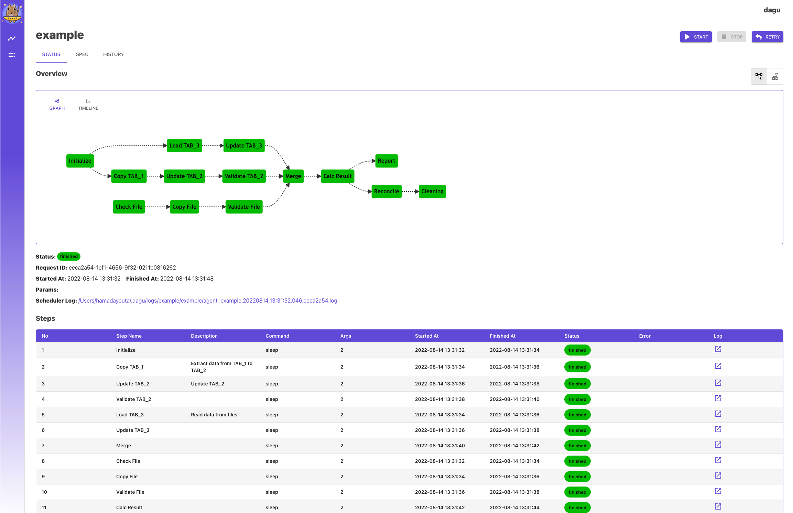

# Dagu 

In this example we will set up [__Dagu__](https://github.com/yohamta/dagu) - a cron alternative with a Web UI, but with much more capabilities.

Dagu can schedule executions of DAGs with Cron expressions, and define dependencies between related 
jobs and represent them as a single DAG (unit of execution).   



!!! info 
    [__Dagu__](https://github.com/yohamta/dagu) can be installed in any workspace. We will use __Python workspace v.4.0__ in this example.

!!! note
    First, we'll use the dagu downloader script to fetch the dagu binary. We'll then create a config file and some example DAGs. 
    Finally, we'll add dagu to the workspace and create a shortcut on the Home page.

## Install

First let's download dagu

<div class="termy">
```bash
$ curl -L https://raw.githubusercontent.com/yohamta/dagu/main/scripts/downloader.sh | bash

% Total    % Received % Xferd  Average Speed   Time    Time     Time  Current
                                 Dload  Upload   Total   Spent    Left  Speed
100   728  100   728    0     0   2628      0 --:--:-- --:--:-- --:--:--  2656
Downloading the latest binary to the current directory...
Downloading dagu v1.8.6...
```
</div>

Now we only need to move dagu to the user's bin folder, which is listed in the PATH 

<div class="termy">
```bash
$ mv dagu ~/bin

with <font color="#FDEB61">abc</font> in <font color="#37E6E8">~/p</font>
```
</div>

## Configure

Create configuration file `~/.dagu/admin.yaml`. You can do it simply by executing

<div class="termy">
```bash
$ mkdir ~/.dagu/ && touch ~/.dagu/admin.yaml

with <font color="#FDEB61">abc</font> in <font color="#37E6E8">~/p</font>
```
</div>


Open this configuration file in your IDE or file browser, and paste the following lines 

```yaml
# Web Server Host and Port
host: 0.0.0.0
port: 8033

# path to the DAGs directory
dags: /home/project/dags

# Web UI Color & Title
navbarColor: "#1E415E"
navbarTitle: Dagu                      

# Basic Auth
isBasicAuth: false

# Base Config
baseConfig: /home/project/dags/config.yaml

# Others
logDir: /home/project/dags/logs/admin
command: /home/abc/bin/dagu
```

In the config file, we've specified the host as `0.0.0.0`, which is essential because the application is running within a Docker 
container. We've also designated 8033 as the port, a vacant one within the workspace's range of 8021-8040.

!!! warning 
    This example relies on port 8033 being available within your workspace. To verify the availability of this port, 
    please consult the 'About' tab within your workspace's UI.

Furthermore, we've denoted `/home/project/dags` as our DAGs directory. Let's establish this folder and navigate into it.

<div class="termy">
```bash
$ mkdir /home/project/dags

with <font color="#FDEB61">abc</font> in <font color="#37E6E8">~/p</font>

$ cd /home/project/dags

with <font color="#FDEB61">abc</font> in <font color="#37E6E8">~/p/dags</font>
```
</div>

Let's create couple of dags in this folder. Open workspace IDE and create file `echo.yaml` with the following content 

```yaml
steps:
  - name: step 1
    command: echo hello
  - name: step 2
    command: echo world
    depends:
      - step 1
```

And file `script.yaml` 

```yaml
steps:
  - name: step 1
    command: "bash"
    script: |
      cd /tmp
      echo "hello world" > hello
      cat hello
    output: RESULT
  - name: step 2
    command: echo ${RESULT} # hello world
    depends:
      - step 1
```

And one file with schedule. Call this file `today.yaml` 

```yaml
schedule: "* * * * *" 
env:
  TODAY: "Saturday"
steps:
  - name: hello
    command: echo "hello, today is ${TODAY}" >> /home/hello.txt
```


## Add to workspace 

To initiate dagu, both the dagu server and scheduler need to be launched. We'll set both up as resilient workspace services. 
Once configured this way, dagu will start automatically each time the workspace is initiated.

Let's first create service for dagu scheduler 

- [X] Open "Admin" tab in the workspace UI and navigate to "Workspace Settings" 
- [X] Go to the tab "Apps & Services"
- [X] Select "START NEW" from the picklist 
- [X] Enter the command - `dagu scheduler`
- [X] Save

  

Now we need to create service for dagu server. Repeat the steps we have made with dagu scheduler. Give it any name, 
as command enter `dagu server`  

  

Restart the workspace for services to get started. You can restart workspace with the command `wrk kill` 


## Add UI tab 

Now, let's proceed to include a shortcut tab for dagu on the workspace's "Home" page. 

This shortcut tab includes a title, description, and image. Utilize the filebrowser or IDE to upload any image of your preference 
into the workspace. The choice of the image is entirely yours. You may want to consider a screenshot of the app itself as one potential option.

After you upload the image to the workspace

- [X] Go to the "Interface" tab of the workspace settings and select "CREATE NEW" from the picklist.   
- [X] Give it any title and description. 
- [X] In the field "Port" enter port 8033 - the port we set in the dagu configuration file.
- [X] In the file picker find your image.   
- [X] Leave field "path" blank and click "Create"


We have added Dagu shortcut to the Home page


 

## Use 

We can access dagu through the newly created shortcut. From here, we can view and manage the DAGs in the /home/project/dags directory, 
even running or creating new ones via the dagu UI. Additionally, we can observe that the 'today' DAG automatically runs every minute 
and review its execution history and logs.


