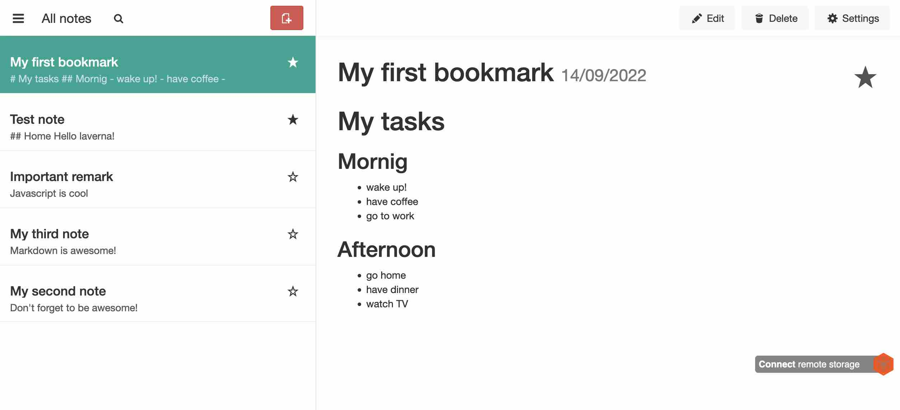
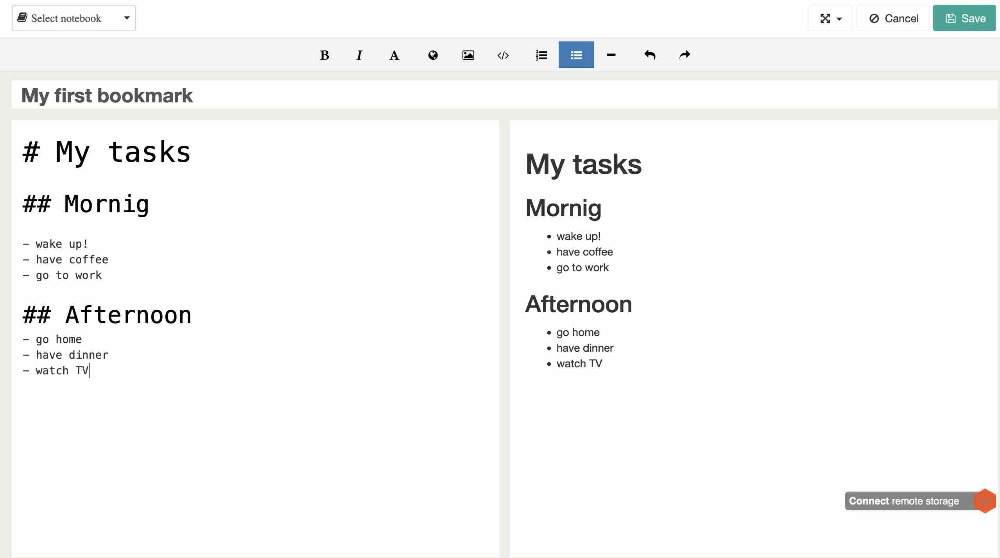
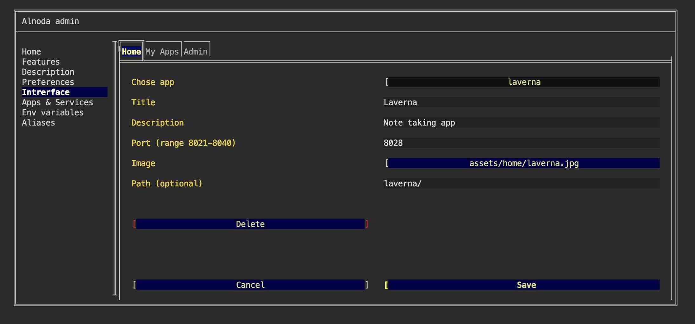
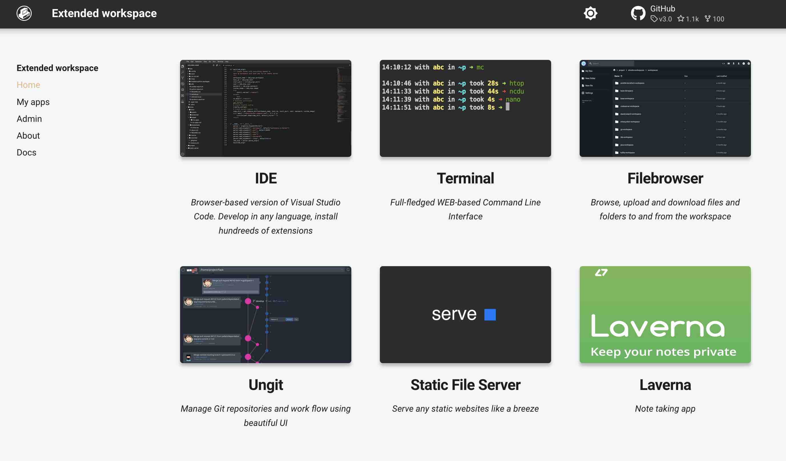

# Laverna - keep your notes private

## Intro

In this example we will add [__Laverna__](https://laverna.cc/index.html) to the workspace.  

Laverna is a JavaScript note-taking web application with a Markdown editor and encryption support. 
It's built to be an open source alternative to Evernote.



Laverna is a pure client-side application. One can either build Laverna onn her own, or download a ready static webpage.  

!!! attention
    Laverna requires static web server. One can use __Extended workspace__ or any other workspaces have this workspace in its lineage. Extended workspace will be used in this example. 

!!! note
    In this example, we will download the webpage with the pre-built version of Laverna, and add Laverna card to the Home tab.  

## Download 

Open workspace terminal and execute to download a prebuilt version of Laverna

<div class="termy">
```bash
$ wget https://github.com/Laverna/static-laverna/archive/gh-pages.zip -O laverna.zip

2022-09-14 10:24:01 (168 KB/s) - ‘laverna.zip’ saved [2460536]
```
</div>


Extract zip into the folder which is served by the Serve (Static web server)

<div class="termy">
```bash
$ unzip laverna.zip -d /home/static-server

...
inflating: /home/static-server/static-laverna-gh-pages/styles/core/fontello/font/fontello.eot  
inflating: /home/static-server/static-laverna-gh-pages/styles/core/fontello/font/fontello.svg  
inflating: /home/static-server/static-laverna-gh-pages/styles/core/fontello/font/fontello.ttf  
inflating: /home/static-server/static-laverna-gh-pages/styles/core/fontello/font/fontello.woff  
inflating: /home/static-server/static-laverna-gh-pages/styles/theme-default.css
```
</div>

The files were extracted into the folder `/home/abc/apps/laverna/static-laverna-gh-pages`. Let's rename it to  
shorter name  

<div class="termy">
```bash
$ mv /home/static-server/static-laverna-gh-pages /home/static-server/laverna

...
inflating: /home/static-server/static-laverna-gh-pages/styles/core/fontello/font/fontello.eot  
inflating: /home/static-server/static-laverna-gh-pages/styles/core/fontello/font/fontello.svg  
inflating: /home/static-server/static-laverna-gh-pages/styles/core/fontello/font/fontello.ttf  
inflating: /home/static-server/static-laverna-gh-pages/styles/core/fontello/font/fontello.woff  
inflating: /home/static-server/static-laverna-gh-pages/styles/theme-default.css
```
</div>

Ok, we age ready! Now we can open Laverna from the "Home" tab of the workspace UI. We simply eed to open  
Serve - static web server, and navigate to folder `lavena`.  


## Use 

Now we can open Laverna and create first note: 



The application stores all your notes in your browser databases such as indexedDB or localStorage, 
which is good for security reasons, because only you have access to them.  

But this makes workspace not very portable. You can only use Laverna on the same machine. Moreover same browser.  

Laverna has a feature to use [remotestorage.io](https://remotestorage.io/) to store notes securely and reliably. 
You can cofigure remote storage in the Laverna settings.  

## Update UI 

If you want to use Laverna often, it would be more tocnvenient to add Laverna card on the Home tab of the workspace UI.   

To create a new card on the Home page, follow these steps:

- [X] Choose any image for the Laverna card, and upload it to the workspace via File Browser.
- [X] Open workspace UI, navigate to "Admin" tab and open "Workspace settings". Then go to "Interface" tab and select "CREATE NEW" from the picklist.
- [X] Give it any title, and any description.
- [X] Choose image you have uploaded.
- [X] Enter port `8028` - the port of the static web server (Serve).
- [X] Use file picker to choose the image you have uploaded.
- [X] Enter path `laverna/`.
- [X] Click "Save".

 

Great! Now we have a nice card for Laverna directly on the Home tab.  

 

## Result

We have downladed a pre-built static webpage with Laverna and serve it with Serve (static web server). We have created a new tab for Laverna 
directly on the Home tab.