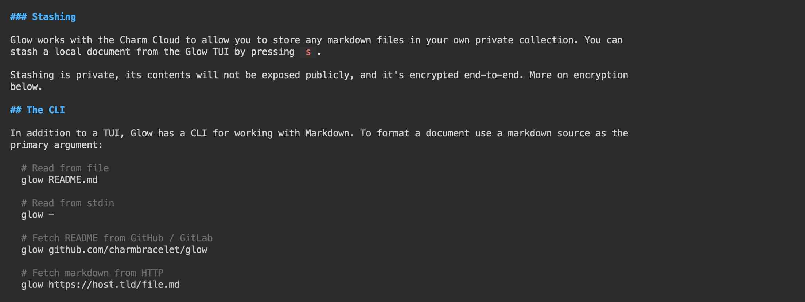

# Glow

In this example we will install [__Glow__](https://github.com/charmbracelet/glow) - a terminal based markdown reader 
designed from the ground up to bring out the beauty and power of the CLI.   



Use [__Glow__](https://github.com/charmbracelet/glow) to discover markdown files, read documentation directly on the command 
line and stash markdown files to your own private collection so you can read them anywhere. Glow will find local markdown files 
in subdirectories or a local Git repository.

!!! info 
    Glow can be installed in any workspace. We will use __Alnoda workspace v.1.1__ in this example.

## Install
With Nix Glow can be installed with a single command 

<div class="termy">
```
$ nix-env -iA nixpkgs.glow

installing 'glow-1.4.1'
...
copying path '/nix/store/nhkhb4dhsvhhyjvrjfx4kh67gk6drrvk-glow-1.4.1' from 'https://cache.nixos.org'...
building '/nix/store/m0ll1v4gchj24xjw4l3hk2dgj4mmlrf0-user-environment.drv'...
```
</div>

Great! Glow is installed and ready to use.  

## Explore

Let's clone Glows own repository, and use Glow to view the Markdown files there 

<div class="termy">
```
$ git clone https://github.com/charmbracelet/glow

Cloning into 'glow'...
remote: Enumerating objects: 3199, done.
remote: Counting objects: 100% (246/246), done.
remote: Compressing objects: 100% (108/108), done.
remote: Total 3199 (delta 153), reused 204 (delta 126), pack-reused 2953
Receiving objects: 100% (3199/3199), 2.65 MiB | 1.21 MiB/s, done.
Resolving deltas: 100% (2126/2126), done.
```
</div>

Go to the cloned directory, and launch Glow

<div class="termy">
```
$ cd glow   
08:01:32 with <font color="#FDEB61">abc</font> in <font color="#37E6E8">~p/glow</font> on <font color="#BC94B7">⇡master</font> <font color="#98E242">➜</font>    

$ glow
```
</div>

You can see the Glow opened. Now we can view Markdown files

## Alias

It is not very convennient to type the whole word "glow" every time we want to use it. let's create a single-character alias 
to open Glow instead:  

- [X] on the workspace UI go to the "Admin" tab, open "Workspace Settings" and go to "Aliases".  
- [X] select "ADD NEW", enter `g` as short name, and `glow` as command. Click "Save".  
- [X] open a new terminal window, go to the cloned repository folder again, and use `g` to open the same markdown file with Glow 

<div class="termy">
```
$ cd glow   
08:03:32 with <font color="#FDEB61">abc</font> in <font color="#37E6E8">~p/glow</font> on <font color="#BC94B7">⇡master</font> <font color="#98E242">➜</font>    

$ g
```
</div>

