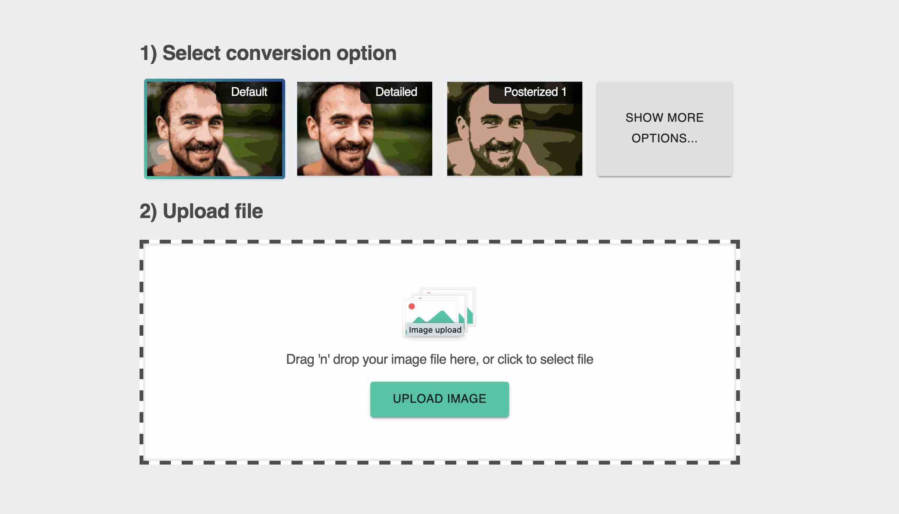
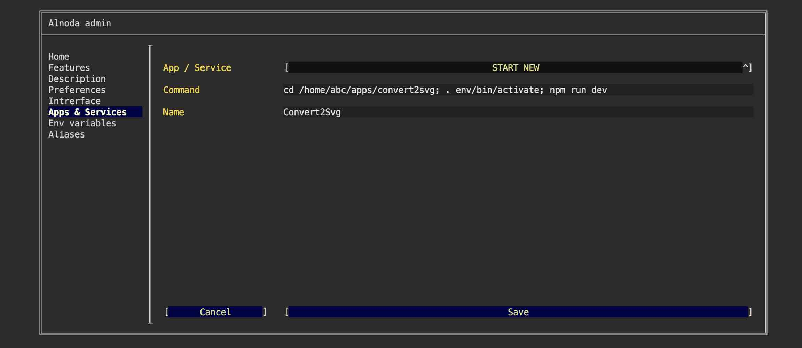
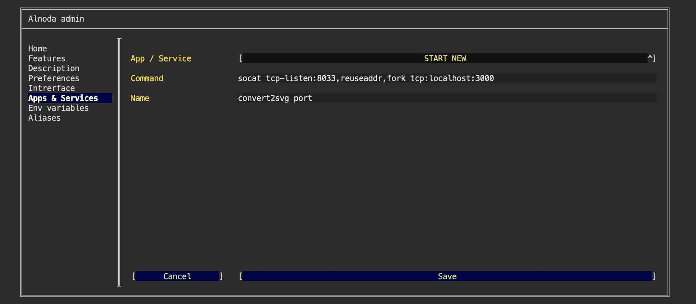
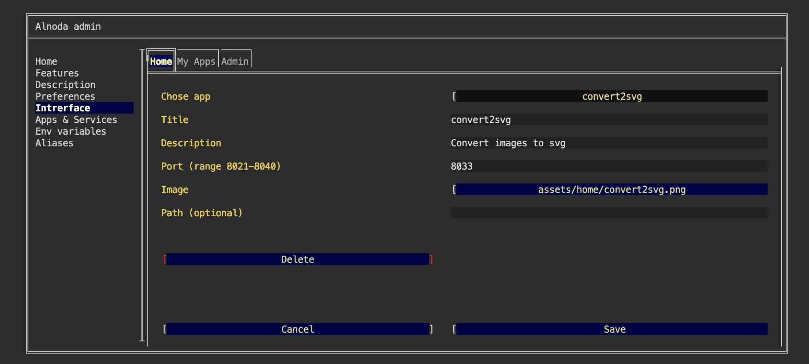

# Convert2Svg 

In this example we will set up [__Convert2Svg__](https://github.com/wwebdev/convert2svg) - web app which converts 
multi-colored images to svg files 



We will create isolated node environment for Convert2Svg, add Convert2Svg to the list of workspace startup services and add 
Convert2Svg tab to the workspace UI. 


## Install 
Open workspace terminal, clone Convert2Svg git repository and enter it:

<div class="termy">
```bash
$ git clone https://github.com/wwebdev/convert2svg.git /home/abc/apps/convert2svg

Cloning into '/home/abc/apps/convert2svg'...
remote: Enumerating objects: 373, done.
remote: Counting objects: 100% (18/18), done.
remote: Compressing objects: 100% (9/9), done.
remote: Total 373 (delta 13), reused 9 (delta 9), pack-reused 355
Receiving objects: 100% (373/373), 906.88 KiB | 2.79 MiB/s, done.
Resolving deltas: 100% (167/167), done.

$ cd /home/abc/apps/convert2svg
with <font color="#FDEB61">abc</font> in <font color="#37E6E8">/home/abc/apps/convert2svg</font> on <font color="#BC94B7">⇡master</font> <font color="#98E242">➜</font>
```
</div>

Create node enviroment and activate it. We use node 14.19.0, you might need to check the required node version at the time of installation:

<div class="termy">
```
$ nodeenv --node=14.19.0 env && . env/bin/activate

 * Install prebuilt node (14.19.0) ..... done.
(env) 19:58:14 with <font color="#FDEB61">abc</font> in <font color="#37E6E8">/home/abc/apps/convert2svg</font> on <font color="#BC94B7">⇡master</font> is 📦  <font color="#5EA702">via ⬢ v14.19.0</font>  <font color="#98E242">➜</font>
```
</div>

Install dependencies:

<div class="termy">
```
$ npm i

added 1057 packages from 453 contributors and audited 1128 packages in 75.61s
```
</div>


## Run

Start Convert2Svg:

<div class="termy">
```
$ npm run dev

[ <font color="#00A7AA">wait</font> ]  compiling ...
[ <font color="#5EA702">ready</font> ] compiled successfully - ready on http://localhost:3000
```
</div>

Convert2Svg is running on port 3000. Let's start port tunneling which would forward traffic to port 8026.  

Open another workspace termianl window, and execute 

<div class="termy">
```
$ socat tcp-listen:8026,reuseaddr,fork tcp:localhost:3000
_
```
</div>

Now we can use shorcut "My app on port 8026" from the "My apps" tab to open Convert2Svg


## Add to workspace

We can use Convert2Svg now. But it was started from the terminal. As soon as we close the terminal, Convert2Svg process will terminalte. 
It is inconvenient to start Convert2Svg via terminal command (together with socat) every time we want to use it.  

It would be more convenient if we didn't have to start Convert2Svg from the terminal each time. Convert2Svg should start 
automatically with all other workspace applications every time we start the workspace.     

Let's add Convert2Svg as a permanent workspace application: 

- [X] Open "Admin" tab oo the workspace UI and avigate to "Workspace Settings" 
- [X] Go to the tab "Apps & Services"
- [X] Select "START NEW" from the picklist 
- [X] Enter the following command 

```sh
cd /home/abc/apps/convert2svg; . env/bin/activate; npm run dev
``` 
This command consists of several parts: 1) go to the Convert2Svg repo, 2) activate node environment, 3) start Convert2Svg

- [X] Give it any name you want 
- [X] Click "Save"



we also need to create service traffic tunneling from port 3000 to another port 

- [X] Open "Admin" tab of the workspace UI and avigate to "Workspace Settings" 
- [X] Go to the tab "Apps & Services"
- [X] Select "START NEW" from the picklist 
- [X] Enter the following command 

```sh
socat tcp-listen:8033,reuseaddr,fork tcp:localhost:3000
``` 

!!! warning 
    This example relies on port 8033 being available within your workspace. To verify the availability of this port, 
    please consult the 'About' tab within your workspace's UI.

- [X] Give it any name you want 
- [X] Click "Save"



Restart workspace to apply changes.


## Create UI tab 

Let's add convert2svg shortcut tab to the workspace "Home" page.   

Shortcut tab has title, description and image. Use filebrowser or IDE to upload any image you want into the workspace. 
You can choose whatever you like, one option - is to create a printscreen of the convert2svg app itself.  

After you upload the image to the workspace

- [X] Go to the "Interface" tab of the workspace settings and select "CREATE NEW" from the picklist.   
- [X] Give it any title and description. 
- [X] In the field "Port" enter port 8033 
- [X] In the file picker find your image.   
- [X] Leave field "path" blank and click "Create"



Now we have convert2svg tab on the Home page 


!!! tip 
    Use the Alnoda Hub for application installation - it greatly simplifies the process! 