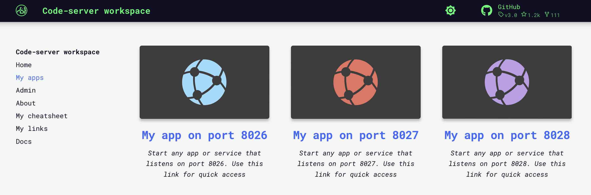

# Limus 

In this example we will set up [__Limus__](https://github.com/ZeroX-DG/limus) in the workspace. Limus makes your screenshot/image 
more professional by rotating, adding shadow and more.  


We will create isolated node environment for Limus and its dependencies. 
Then we will start it in a permanent way, and add Limus tab shortcut to the workspace UI. 


## Install 

Open workspace terminal, clone Limus git repository and enter it:

<div class="termy">
```bash
$ git clone https://github.com/ZeroX-DG/limus /home/abc/apps/limus

Cloning into '/home/abc/apps/limus'...

$ cd /home/abc/apps/limus
with <font color="#FDEB61">abc</font> in <font color="#37E6E8">/home/abc/apps/limus</font> on <font color="#BC94B7">⇡master</font> <font color="#98E242">➜</font>
```
</div>

Create node enviroment and activate it:

<div class="termy">
```
$ nodeenv --node=12.18.3 env && . env/bin/activate

 * Install prebuilt node (12.18.3) ..... done.
(env) 19:58:14 with <font color="#FDEB61">abc</font> in <font color="#37E6E8">/home/abc/apps/limus</font> on <font color="#BC94B7">⇡master</font> is 📦  <font color="#5EA702">via ⬢ v12.18.3</font>  <font color="#98E242">➜</font>
```
</div>

Install dependencies:

<div class="termy">
```
$ npm install

...
added 962 packages from 702 contributors and audited 963 packages in 26.625s
```
</div>

Build the app:

<div class="termy">
```
$ npm run build

✨  <font color="#99E343"><b>Built in 12.35s.</b></font>
```
</div>

Install http-server:

<div class="termy">
```
$ npm install http-server -g

+ http-server@14.1.1
added 39 packages from 43 contributors in 4.281s
```
</div>


## Run

Deploy the `dist/` folder just like a static web page using http-server:

<div class="termy">
```
$ cd dist && http-server -p 8026

<font color="#C4A502">Available on:</font>
  http://127.0.0.1:<font color="#99E343">8026</font>
  http://172.17.0.3:<font color="#99E343">8026</font>
Hit CTRL-C to stop the server
```
</div>

Now you can open Limus using tab "My App on port 8026":




## Add to workspace

We can use Limus. But it was started from the terminal. As soon as we close the terminal, Limus process will terminalte. 
It is inconvenient to start Limus via terminal command (together with socat) every time we want to use it.  

It would be better if Limus starts 
automatically with all other workspace applications every time we start the workspace. 
Let's add Limus as a permanent workspace application: 

- [X] Open "Admin" tab on the workspace UI and avigate to "Workspace Settings" 
- [X] Go to the tab "Apps & Services"
- [X] Select "START NEW" from the picklist 
- [X] Enter the following command 

```sh
cd /home/abc/apps/limus; . env/bin/activate; cd dist; http-server -p 8032
``` 
This command consists of several parts: 1) go to the Limus repo, 2) activate node environment, 3) serve Limus on port 8032

- [X] Give it any name you want 
- [X] Click "Save"


Restart workspace to apply changes.


## Create UI tab 

Let's add Limus shortcut tab to the workspace "Home" page.   

Shortcut tab has title, description and image. Use filebrowser or IDE to upload any image you want into the workspace. 
You can choose whatever you like, one option - is to create a printscreen of the Limus app itself.  

After you upload the image to the workspace, make the following actions:

- [X] Go to the "Interface" tab of the workspace settings and select "CREATE NEW" from the picklist.   
- [X] Give it any title and description. 
- [X] In the field "Port" enter port 8032 
- [X] In the file picker find your image.   
- [X] Leave field "path" blank and click "Create"


Now we have Limus tab on the Home page 


!!! tip 
    Use the Alnoda Hub for application installation - it greatly simplifies the process! 
