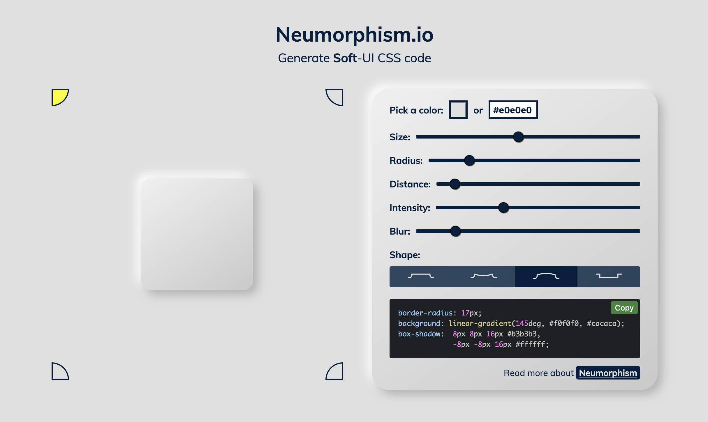
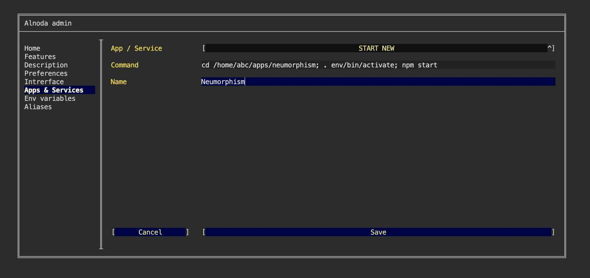
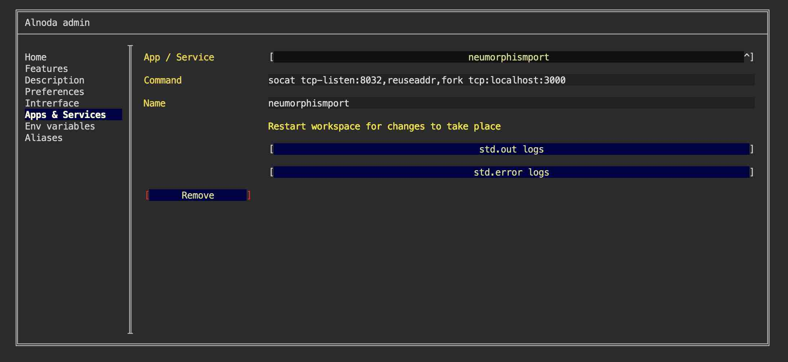
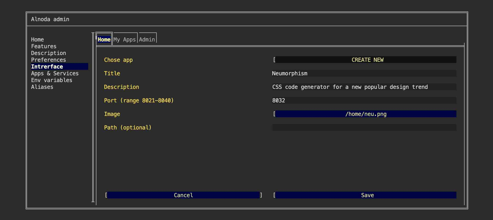
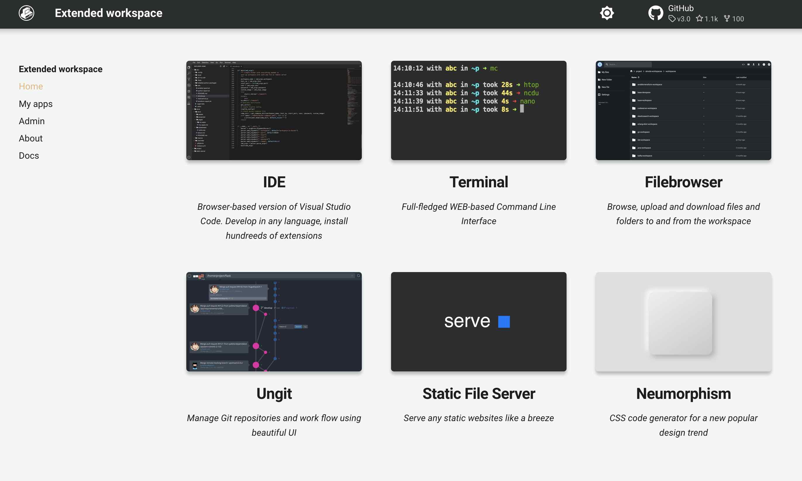

# Neumorphism 

In this example we are going to add [__Neumorphism__](https://github.com/adamgiebl/neumorphism) - a s CSS code generator 
for a popular design trend called Neumorphism/Soft UI.  



We will create isolated node environment for Neumorphism and its dependencies. 
Then we will start it in a permanent way, and add Neumorphism tab shortcut to the workspace UI.  

## Install 

Open workspace terminal, clone Neumorphism git repository and navigate into it:

<div class="termy">
```bash
$ git clone https://github.com/adamgiebl/neumorphism.git /home/abc/apps/neumorphism

Cloning into '/home/abc/apps/neumorphism'...
remote: Enumerating objects: 1212, done.
remote: Counting objects: 100% (125/125), done.
remote: Compressing objects: 100% (42/42), done.
remote: Total 1212 (delta 86), reused 109 (delta 83), pack-reused 1087
Receiving objects: 100% (1212/1212), 1.56 MiB | 289.00 KiB/s, done.
Resolving deltas: 100% (798/798), done.

$ cd /home/abc/apps/neumorphism
with <font color="#FDEB61">abc</font> in <font color="#37E6E8">/home/abc/apps/neumorphism</font> on <font color="#BC94B7">⇡master</font> <font color="#98E242">➜</font>
```
</div>

Create node enviroment and activate it:

<div class="termy">
```
$ nodeenv --node=18.9.0 env && . env/bin/activate

 * Install prebuilt node (18.9.0) ..... done.
(env) 19:58:14 with <font color="#FDEB61">abc</font> in <font color="#37E6E8">/home/abc/apps/neumorphism</font> on <font color="#BC94B7">⇡master</font> is 📦  <font color="#5EA702">via ⬢ v18.9.0</font>  <font color="#98E242">➜</font>
```
</div>

Install dependencies:

<div class="termy">
```
$ npm install

...
added 1685 packages, and audited 1686 packages in 1m
```
</div>


## Run

Start Neumorphism application:

<div class="termy">
```
$ npm start

...
Search for the keywords to learn more about each warning.
To ignore, add // eslint-disable-next-line to the line before.
```
</div>

The application has started and listens to the port 3000.  

Workspace exposes port range 8020-8040, lets forward port 3000 to any of the free ports in the workspace port range. 
You can find free port on the "About" tab in the workspace UI page.  

Forward port 8026 to port 3000. Ope another workspace terminal and execute: 

<div class="termy">
```
$ socat tcp-listen:8026,reuseaddr,fork tcp:localhost:3000

```
</div>

Now we can open Neumorphism using shorcut "My app on port 8026" from the "My apps" tab.


## Add to workspace

We can use Neuromorphism now, but it was started from the terminal. As soon as we close the terminal, Neuromorphism process will terminalte. 
It is inconvenient to start Neuromorphism in terminal every time we want to use it (together with socat).  

Let's add Neuromorphism as a permanent workspace application, it will start 
automatically with all other workspace applications every time we start the workspace.  

- [X] Open "Admin" tab oo the workspace UI and avigate to "Workspace Settings" 
- [X] Go to the tab "Apps & Services"
- [X] Select "START NEW" from the picklist 
- [X] Enter the following command 

```
cd /home/abc/apps/neumorphism; . env/bin/activate; npm start
``` 
This command consists of 3 parts: 1) go to the Neumorphism repo, 2) activate node environment, 3) start Neumorphism

- [X] Give it any name you want 
- [X] Click "Save"



Now let's create service for the port tuneling as well

- [X] Select "START NEW" from the picklist 
- [X] Enter the following command 

```
socat tcp-listen:8032,reuseaddr,fork tcp:localhost:3000
``` 
This time we will forward traffic from port 3000 to 8032 - one of the workspace free ports.

- [X] Give it any name you want 
- [X] Click "Save"



Please restart workspace to apply changes.


## Create UI tab 

Let's add Neumorphism shortcut tab to the workspace "Home" page.   

Shortcut tab has title, description and image. Use filebrowser or IDE to upload any image you want into the workspace. 
You can choose whatever you like, one option - is to create a printscreen of the Neumorphism app itself.  

After you upload the image to the workspace, follow the next steps:

- [X] Go to the "Interface" tab of the workspace settings and select "CREATE NEW" from the picklist.   
- [X] Give it any title and description. 
- [X] In the field "Port" enter port 8032 - the port we used to forward traffic from port 3000
- [X] In the file picker find your image.   
- [X] Leave field "path" blank and click "Create"



Now we have Neumorphism tab on the Home page: 



!!! tip 
    Use the Alnoda Hub for application installation - it greatly simplifies the process! 