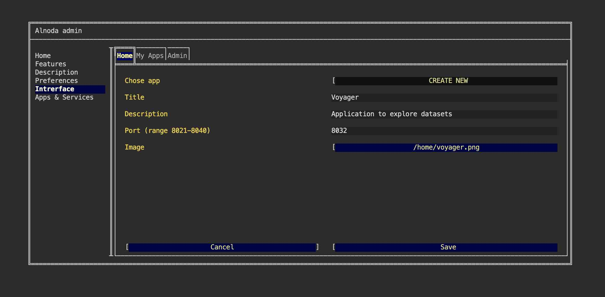

# Voyager 

In this example we are going to add [__Voyager__](https://github.com/vega/voyager) - a data exploration tool with a browser-based user interface that blends manual and automated chart specification.     


Voyager is a Javascript application. We will clone code repository, install dependencies and build Voyager.  

## Requirements

First thing is to install python2. Voyager has rather outdated dependencies. 
Luckily workspace is completely isolated, and this won't affect you main environment.  

Open workspace terminal and execute the next commands:

<div class="termy">
```bash
$ sudo apt-get update
$ sudo apt-get install -y python2

Preparing to unpack .../python2_2.7.17-2ubuntu4_amd64.deb ...
Unpacking python2 (2.7.17-2ubuntu4) ...
Setting up libpython2.7-stdlib:amd64 (2.7.18-1~20.04.3) ...
Setting up python2.7 (2.7.18-1~20.04.3) ...
Setting up libpython2-stdlib:amd64 (2.7.17-2ubuntu4) ...
Setting up python2 (2.7.17-2ubuntu4) ...
Processing triggers for mime-support (3.64ubuntu1) ...
```
</div>

## Build

Now, clone Voyager GitHub repository, and go into it:

<div class="termy">
```bash
$ git clone https://github.com/vega/voyager.git ~/apps/voyager

Cloning into '/home/abc/apps/voyager'...
remote: Enumerating objects: 21671, done.
remote: Counting objects: 100% (185/185), done.
remote: Compressing objects: 100% (163/163), done.
remote: Total 21671 (delta 64), reused 103 (delta 20), pack-reused 21486
Receiving objects: 100% (21671/21671), 77.35 MiB | 2.90 MiB/s, done.
Resolving deltas: 100% (14910/14910), done.

$ cd ~/apps/voyager

with <font color="#FDEB61">abc</font> in <font color="#37E6E8">~/apps/voyager</font> on <font color="#BC94B7">⇡master</font> <font color="#98E242">➜</font>
```
</div>

Create an isolate node environment:

<div class="termy">
```
$ nodeenv --node=12.18.3 env

with <font color="#FDEB61">abc</font> in <font color="#37E6E8">~/apps/voyager</font> on <font color="#BC94B7">⇡master</font> <font color="#98E242">➜</font> <font color="#5EA702">nodeenv</font> --node=12.18.3 env
 * Install prebuilt node (12.18.3) ..... done.
```
</div>

Activate this environment

<div class="termy">
```
$ . env/bin/activate

(env) 18:11:21 with <font color="#FDEB61">abc</font> in <font color="#37E6E8">~/apps/voyager</font> on <font color="#BC94B7">⇡master</font> 📦 <font color="#F54235">v2.0.0-alpha.24</font> via <font color="#99E343">⬢ v12.18.3</font> <font color="#98E242">➜</font> 
```
</div>

Install yarn

<div class="termy">
```
$ npm install -g yarn

+ yarn@1.22.19
added 1 package in 1.697s
```
</div>

Install required packages

<div class="termy">
```
$ yarn

Binary found at /home/abc/apps/voyager/node_modules/node-sass/vendor/linux-x64-72/binding.node
Testing binary
Binary is fine
node-sass@4.14.1 /home/abc/apps/voyager/node_modules/node-sass
Done in 91.65s.
```
</div>

Build Voyager

<div class="termy">
```
$ yarn build

Done in 144.69s.
```
</div>

## Run

We have built voyager, now we can start it

<div class="termy">
```
$ yarn start

<font color="#3C6894">ℹ</font> <font color="#646562">｢wdm｣</font>: Compiled successfully.
```
</div>

Voyager operates on port 9000. To verify if it's active, you can open another terminal and run curl localhost:9000.

However, at this point, Voyager is only accessible from the terminal. The workspace exposes the port range of 8020-8040. 
So, we'll set up port forwarding from port 9000 to 8026, allowing us to open Voyager in the browser like any other application.

To do this, open a new terminal window and execute the following command:

<div class="termy">
```
$ socat tcp-listen:8026,reuseaddr,fork tcp:localhost:9000

<font color="#646562">_</font>
```
</div>

Now we can open Voyager from the "My-apps" tab on the workspace UI.   


As soon as we close terminal Voyager will terminale. To keep Voyager running continuously, even after closing the terminal or 
restarting the workspace, add it as a permanent application via the workspace admin page.

## Permanent service

Let's add Voyager as a permanent workspace application. Go to the "Admin" tab, open "Workspace Settings" and go to "Apps & Services".  

Here we can add new applications to the workspace. To do this we need to provide the command that sarts an application or service, 
and give this service a name.  

Let's first create an entry for Voyager. Select "START NEW" from the picklist, enter any name and paste this command

```sh
cd ~/apps/voyager; . env/bin/activate; yarn start
```

This commad will start Voyager. It consist of 3 sub-commands, separated by semicolon: 
go to voyager folder, activate environment and start application.  


Let's also start the port tunneling, which will map voyager's port 9000 to the port 8032. The latter is in the exposed range, hence it 
can be accessed.   

Select "START NEW" from the picklist, enter any name and paste this command

```sh
socat tcp-listen:8032,reuseaddr,fork tcp:localhost:9000
```

Please restart the workspace for new applications to start.  

## Update UI

Finally, let's add Voyager shortcut to the workspace UI. This will allow us to open Voyager directly from the worspace UI page.   

Shortcut has title, description and image. Use filebrowser or IDE to upload any image into the workspace. 
You can choose whatever you like, one option - is to create a printscreen of the Voyager app itself.  

After you upload the image to the workspace, go to the "Interface" tab of the workspace settings and select "CREATE NEW" from the picklist.   



Give it any title and description. In the field "Port" enter port 8032. Leave field "path" blank. Then select your image.   

Now we have Voyager tab on the Home page of the workspace. 


!!! tip 
    Use the Alnoda Hub for application installation - it greatly simplifies the process! 
    
