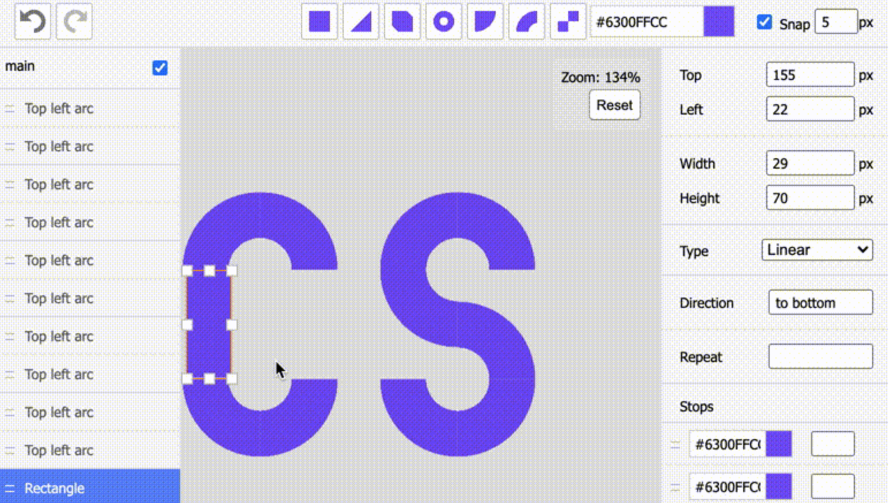
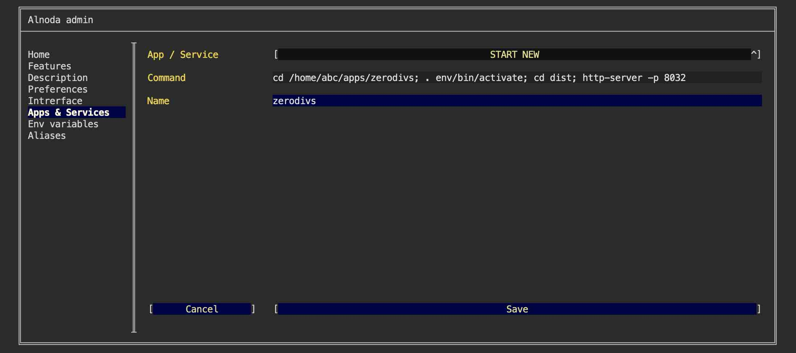
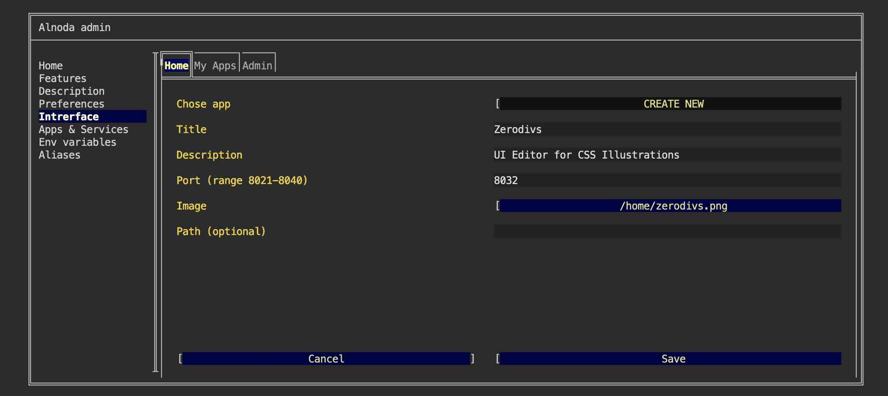
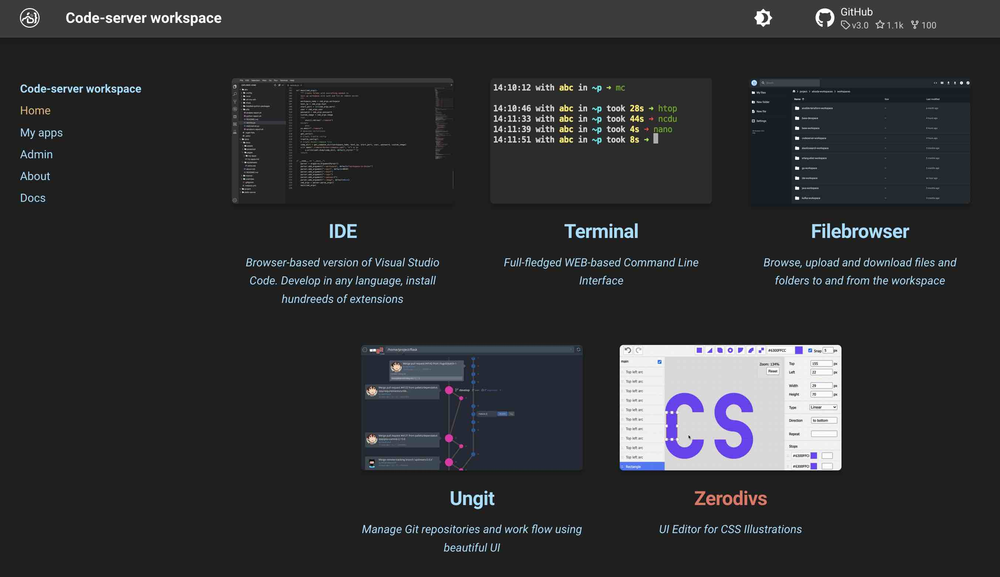

# ZeroDivs  

In this example we will set up [__ZeroDivs__](https://github.com/jperals/zerodivs) - a UI Editor for creating CSS illustrations 
with a single HTML element 



We will create isolated node environment for ZeroDivs and its dependencies. 
Then we will start it in a permanent way, and add ZeroDivs tab shortcut to the workspace UI. 


## Prepare  

First thing is to install python2. ZeroDivs has rather outdated dependencies. 
Luckily workspace is completely isolated, and this won't affect you main environment.  

Open workspace terminal and execute the next commands:

<div class="termy">
```bash
$ sudo apt-get update
$ sudo apt-get install -y python2

Preparing to unpack .../python2_2.7.17-2ubuntu4_amd64.deb ...
Unpacking python2 (2.7.17-2ubuntu4) ...
Setting up libpython2.7-stdlib:amd64 (2.7.18-1~20.04.3) ...
Setting up python2.7 (2.7.18-1~20.04.3) ...
Setting up libpython2-stdlib:amd64 (2.7.17-2ubuntu4) ...
Setting up python2 (2.7.17-2ubuntu4) ...
Processing triggers for mime-support (3.64ubuntu1) ...
```
</div>


## Install 

Open workspace terminal, clone ZeroDivs git repository and enter it:

<div class="termy">
```bash
$ git clone https://github.com/jperals/zerodivs /home/abc/apps/zerodivs

Cloning into '/home/abc/apps/zerodivs'...
remote: Enumerating objects: 1915, done.
remote: Counting objects: 100% (319/319), done.
remote: Compressing objects: 100% (174/174), done.
remote: Total 1915 (delta 159), reused 256 (delta 138), pack-reused 1596
Receiving objects: 100% (1915/1915), 3.55 MiB | 13.08 MiB/s, done.
Resolving deltas: 100% (1336/1336), done.

$ cd /home/abc/apps/zerodivs
with <font color="#FDEB61">abc</font> in <font color="#37E6E8">/home/abc/apps/zerodivs</font> on <font color="#BC94B7">⇡master</font> <font color="#98E242">➜</font>
```
</div>

Create node enviroment and activate it:

<div class="termy">
```
$ nodeenv --node=12.18.3 env && . env/bin/activate

 * Install prebuilt node (12.18.3) ..... done.
(env) 19:58:14 with <font color="#FDEB61">abc</font> in <font color="#37E6E8">/home/abc/apps/zerodivs</font> on <font color="#BC94B7">⇡master</font> is 📦  <font color="#5EA702">via ⬢ v12.18.3</font>  <font color="#98E242">➜</font>
```
</div>

Local project setup:

<div class="termy">
```
$ npm install

...
added 1702 packages from 1562 contributors and audited 1704 packages in 46.76s
```
</div>

Build ZeroDivs: 

<div class="termy">
```
$ npm run build

...
Search for the keywords to learn more about each warning.
To ignore, add // eslint-disable-next-line to the line before.
```
</div>


## Run

Install http-server:

<div class="termy">
```
$ npm install http-server -g

+ http-server@14.1.1
added 39 packages from 43 contributors in 4.852s
```
</div>

Start the http-server:

<div class="termy">
```
$ cd dist && http-server -p 8026

...
Search for the keywords to learn more about each warning.
To ignore, add // eslint-disable-next-line to the line before.
```
</div>

In the workspace UI open "My Apps" and click "My app on port 8026".  


## Add to workspace

We can use ZeroDivs now but it was started from the terminal. As soon as we close the terminal, ZeroDivs process will terminalte. 
It is inconvenient to start ZeroDivs via terminal command (together with socat) every time we want to use it.     

Let's add ZeroDivs as a permanent workspace application: 

- [X] Open "Admin" tab oo the workspace UI and avigate to "Workspace Settings" 
- [X] Go to the tab "Apps & Services"
- [X] Select "START NEW" from the picklist 
- [X] Enter the following command 

```sh
cd /home/abc/apps/zerodivs; . env/bin/activate; cd dist; http-server -p 8032
``` 
This command consists of several parts: 1) go to the ZeroDivs repo, 2) activate node environment, 3) serve ZeroDivs on port 8032

- [X] Give it any name you want 
- [X] Click "Save"



Restart workspace to apply changes.


## Create UI tab 

Let's add ZeroDivs shortcut tab to the workspace "Home" page.   

Shortcut tab has title, description and image. Use filebrowser or IDE to upload any image you want into the workspace. 
You can choose whatever you like, one option - is to create a printscreen of the ZeroDivs app itself.  

After you upload the image to the workspace perform the following steps:

- [X] Go to the "Interface" tab of the workspace settings and select "CREATE NEW" from the picklist.   
- [X] Give it any title and description. 
- [X] In the field "Port" enter port 8032 
- [X] In the file picker find your image.   
- [X] Leave field "path" blank and click "Create"



Now we have ZeroDivs tab on the Home page 



!!! tip 
    Use the Alnoda Hub for application installation - it greatly simplifies the process! 