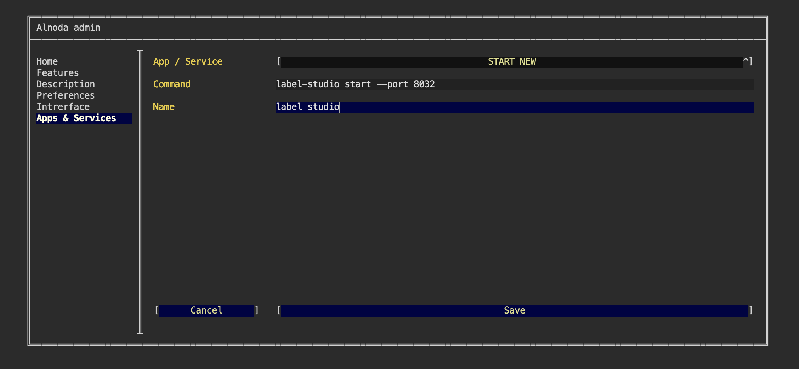
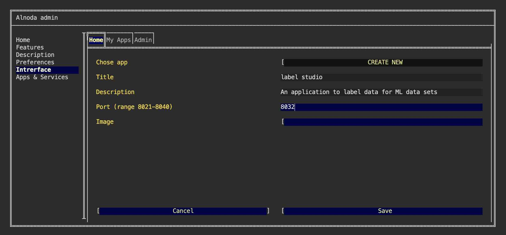
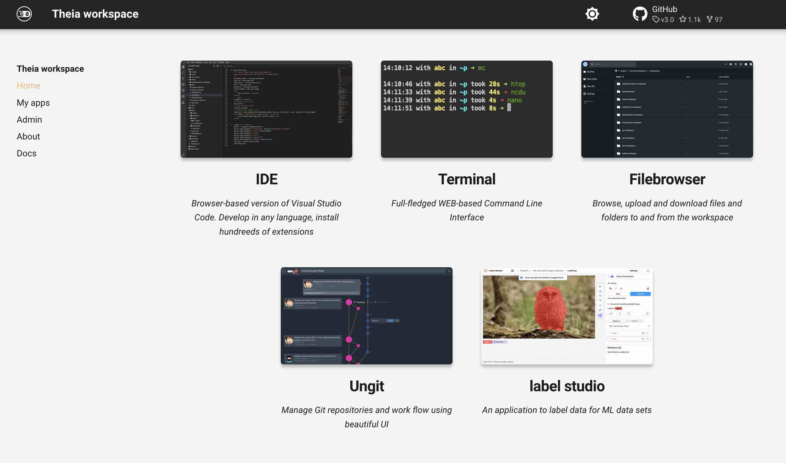

# Label Studio 

In this example we are going to install [__Label Studio__](https://labelstud.io/) - an open source data labeling tool. 
It lets you label data types like audio, text, 
images, videos, and time series with a simple and straightforward UI and export to various model formats. 
It can be used to prepare raw data or improve existing training data to get more accurate ML models.


!!! info
    Label Studio can be installed in any workspace. We will use __Theia workspace v.5.0__ in this example.    

[Label Studio](https://pypi.org/project/label-studio/) is a python package which we will install in the isolated environment 
with [__pipx__](https://github.com/pypa/pipx):
 
<div class="termy">
```bash
$ pipx install label-studio

  installed package label-studio 1.5.0.post0, installed using Python 3.8.10
  These apps are now globally available
    - label-studio
done! ✨ 🌟 ✨
```
</div>

Label Studio is installed and ready to be used. 

## Run

Let's start Label Studio on the port 8026

<div class="termy">
```bash
$ label-studio start --port 8026

System check identified no issues (1 silenced).
September 05, 2022 - 12:52:41
Django version 3.1.14, using settings 'label_studio.core.settings.label_studio'
Starting development server at http://0.0.0.0:8026/
Quit the server with CONTROL-C.
```
</div>

Label Studio is now operational, actively listening on port 8026, and readily accessible from the "My apps" page for quick access.

While Label Studio is functional, we aim to implement two enhancements:

1. Persistence. Ensure Label Studio remains active even after closing the terminal session or stopping and restarting the workspace.
2. Update UI. Create a shortcut for Label Studio, rather than relying on the generic "My app on port 8026".

## Permanent service

If you currently have Label Studio running in your terminal, you can safely close it.

To start Label Studio in a resilient manner, follow these steps:

1. Open the workspace UI page.
2. Navigate to the "Admin" tab and select "Workspace settings".
3. In the workspace settings, go to "Apps & Services".
4. Choose the "START NEW" option from the picklist.
5. Copy and paste the following command:

```bash
label-studio start --port 8032
```

This is a command that would start Label Studio in a resilient manner. Give it any name, and click "Save"



To initiate Label Studio, please restart the workspace. 

By starting Label Studio using this method, it will persist even if you restart the workspace again. Notably, it is now running on a 
different port, specifically 8032. This port can been selected if it is not used by any other application within 
the workspace.

## UI card

Let's proceed with creating a card specifically for Label Studio and placing it on the "Home" tab of the workspace UI page.

1. To begin, choose an image for this card. Feel free to select any image, including a screenshot of Label Studio.

2. Upload the chosen image to the workspace using Filebrowser or an IDE.

3. Next, navigate to the "Admin" tab and open "Workspace settings". Proceed to the "Interface" section and select "CREATE NEW" from the picklist.

4. Provide a name, title, and description for the card. It is crucial to enter the port as __8032__ since we started Label Studio on this specific port.



The final step is to find the image you have uploaded using the file picker

 

A user-friendly card for Label Studio has been successfully created on the Home page, providing convenient access to its WEB UI.


