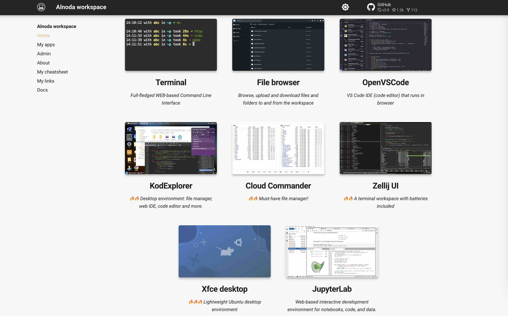

# Workspace UI 

Alnoda workspaces have browser-based user interface. It allows you to access workspace applications, review workspace metadata, 
and display notes related to the project, including project descriptions, project links, and shortcuts for common project commands. 

## Home 

This tab provides shortcuts to the primary applications within the workspace. 

## My Apps 

This tab comprises shortcuts to applications that are set to listen on several predetermined ports. These ports can also be used 
to run your custom applications.

## Admin

This tab is designed for quick access to _Workspace Admin App_ and other admin applications such as process monitors, network monitoring, task schedulers, and so on 

## About

This tab provides meta-information about the workspace including the workspace version, project description, images this workspace is built upon, 
services currently running, and installed applications. 

## Links

This tab hosts a list of internet links that are pertinent to the project. These links can be created and modified via the _Workspace Admin App_.

## Cheatsheet

This section hosts a compilation of project-relevant commands that users can maintain and modify through the _Workspace Admin App_.