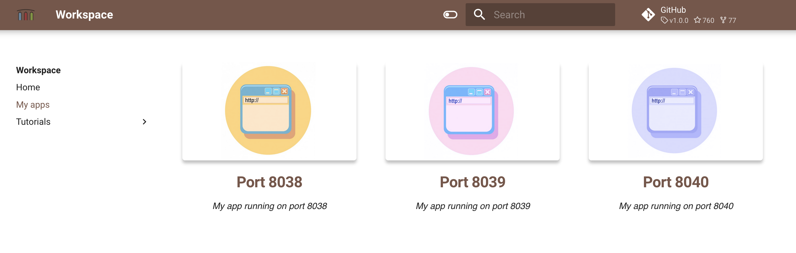

This simple tutorial demonstrates how to create Go Hello-world application, install dependencies with Go Modules, 
build, run, and install Go applications.  

## Example: hello world

Check Go version 

```
go version
```

Create new Go project

```
mkdir myProject/
cd myProject
go mod init myProject
```

Create file `main.go`

```
package main
import "fmt"
func main() {
  fmt.Println("Hello Go")
}
```

Then test it using the go run command 

```
go run main.go 
```

## Dependencies

Go Modules - Go’s dependency management system that makes dependency version information explicit and easier to manage.  

Create new Go project

```
mkdir simpleserver/
cd simpleserver
go mod init simpleserver
```

Adding a remote module as a dependency manually:

```
go get github.com/spf13/cobra@latest
```

Check `go.mod` file 

```
cat go.mod
```

Create file `main.go`  

```
package main
import "github.com/gin-gonic/gin"

func main() {
    r := gin.Default()
    r.GET("/", func(c *gin.Context) {
        c.JSON(200, gin.H{
                "message": "pong",
        })
    })
    r.Run() 
}
```

To add module requirements and sums execute

```
go mod tidy
```

## Run, build and install

- `go run` - to quickly test your go code and to check the output. But internally it compiles your code and builds an executable binary in a temporary location, launches that temp exe-file and finally cleans it when your app exits.
- `go build` - compile and builds executable in current directory.
- `go install` - will compile and move the executable to executable directory included in $PATH, so that you can run this executable from any path on the terminal. 

Run the simple server with 

```
export PORT=8040
go run main.go
```

Open Quickstart page, go to "My apps" and use port 8040 shortcut to open your web app



Build executable locally 

```
go build
```

This will create an executable `simpleserver` in the same folder.   

Build and move to executable folder 

```
go install
```

Now you can execute anywhere in terminal 

```
export PORT=8040
simpleserver
```

and the server will start