## Data Exploration

To work with data sucessfully, it is important to be able to explore data, look on the raw table, 
plot charts and plot such as scatterplots, correlation tables, outlier heatmaps, etc.  

Workspace has tools to explore raw datasets. It also has configured extensions and widgets for Jupyter n
otebooks and Jupyterlab for data exploration and discovery.   

To start with, copy tutorial notebooks into the project forlder.

```
cp -r /home/examples/tutorials /home/project
```

## Jupyter Lab 

You can view data files, such as .csv in a nice tabular form directly in Jupyter lab. Go to Jupyter Lab from the 
Quickstart page, and open file 'cars.csv' in folder 'tutorials' from Jupyter Lab 

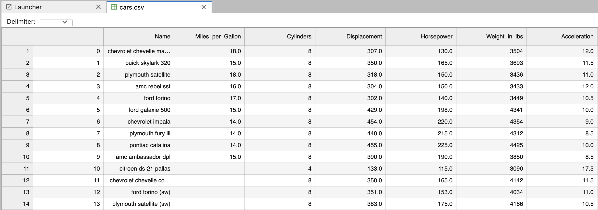

You can explore notebook 'cars-jupyter.ipynb' to see how to import and export data from .csv files. 


## Data Preview

[Data Preview](https://marketplace.visualstudio.com/items?itemName=RandomFractalsInc.vscode-data-preview) - is a VS-Code 
extension which provides tabular view for csv files and allows interactive exploration of such files.  

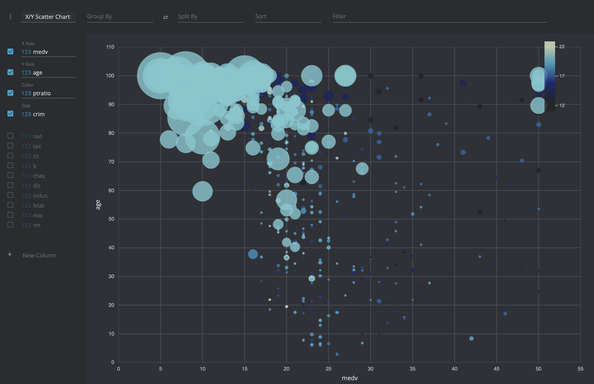

It is very convenient for initial exploration of the csv files before loading them to pandas dataframes.  


## Lux

By simply printing out a dataframe in a Jupyter notebook, [Lux](https://github.com/lux-org/lux) 
recommends a set of visualizations highlighting interesting trends and patterns in the dataset. 
Visualizations are displayed via an interactive widget that enables users to quickly browse through large collections 
of visualizations and make sense of their data.

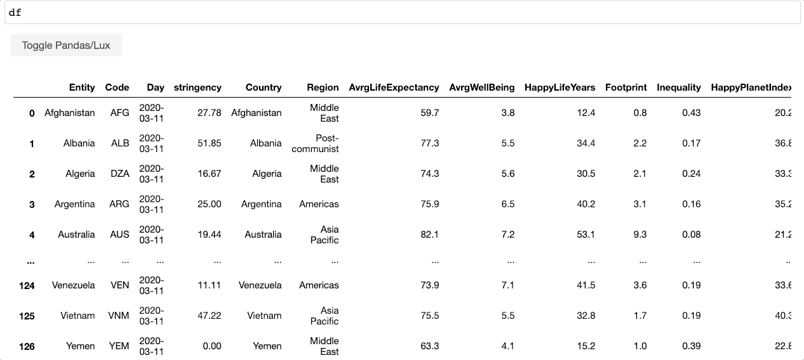

To try Lux open in Jupyter, Jupyterlab or VS-Code small example notebook `tutorials/lux.ipynb`. 
Follow the instruction and execute notes 


## QGrid

[Qgrid](https://github.com/quantopian/qgrid) is a Jupyter notebook widget which uses SlickGrid to render pandas DataFrames 
within a Jupyter notebook. This allows you to explore your DataFrames with intuitive scrolling, sorting, and filtering controls, 
as well as edit your DataFrames by double clicking cells.  

__NOTE:__ Qgrid works only i Jupyter notebooks, and is not working with current version of Jupyterlab.  

Open in Jupyter notebook example notebook `tutorials/qgrid.ipynb` and run cells one-by-one 

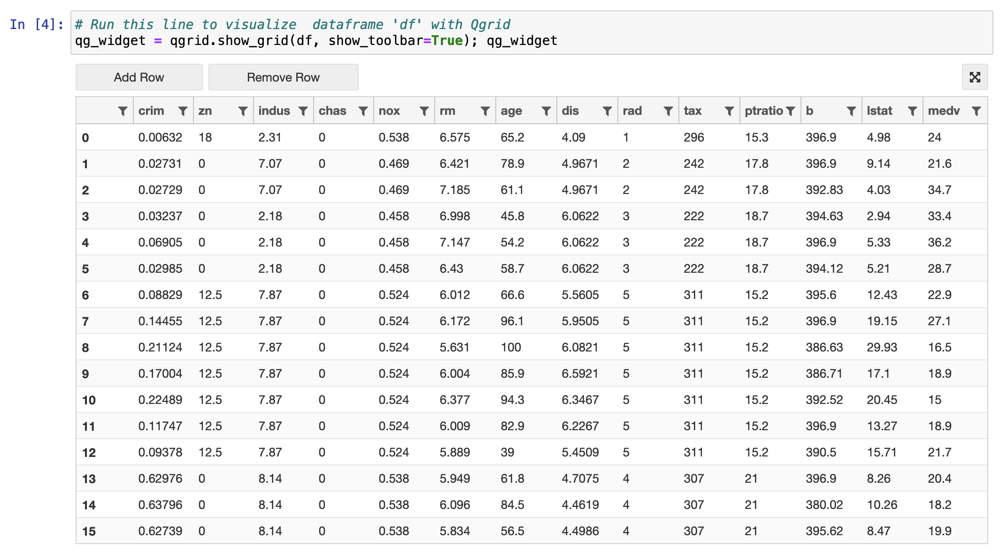

QGrid is extremely convenient if you need to work with multiple data frames, or need to apply complex transformations to 
the same dataframe. You can vizualise every step of thransformation, look on the whole dataset, filter and order columns.

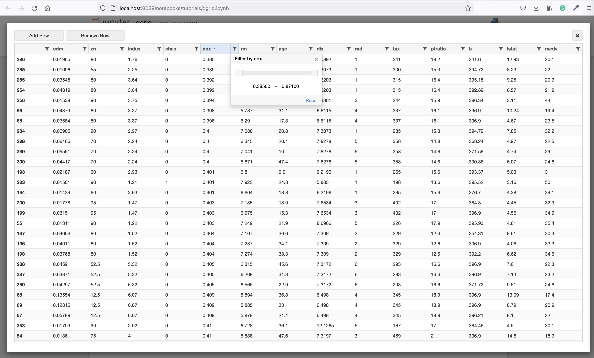


## D-Tale

[D-Tale](https://github.com/man-group/dtale) - is a comprehensive solution that allows to explore and analyze raw data files, 
as well as pandas dataframes. D-Tale is extremely powerful, is great toolset to visualise, explore and study the datasets.  

Open D-Tale from the Quickstart page. Upload your data file, or use example dataset to start with 

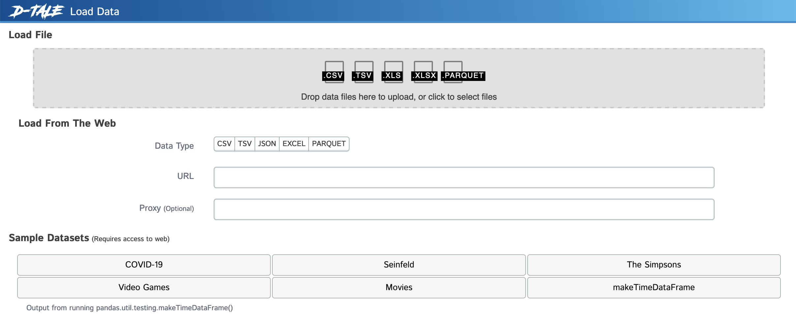

Load the Movies Sample dataset. Dataset will be displayed as an iteractive table. All the cells of this table can be edited, 
and you can make direct changes to the values just like in excel.  

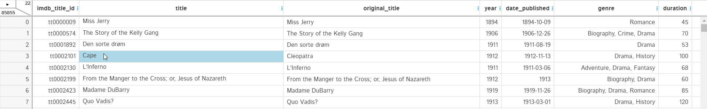

Whenever you click on the column header, you will get a list of options depending upon the type of data the column contains. 


Among other actions you can sort, order and filter table 

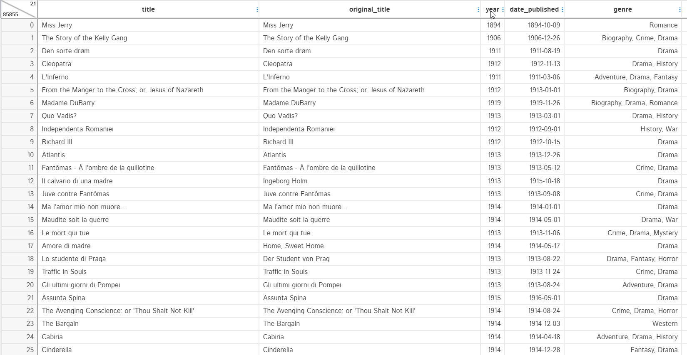

Highlighters are used to highlight some sections of the dataset. Like we use stylers in pandas to bring out the odd values, 
highlighters do the same job. You can highlight missing values, Data types, Outliers, and range. The example below shows 
how the missing values and outliers have been highlighted

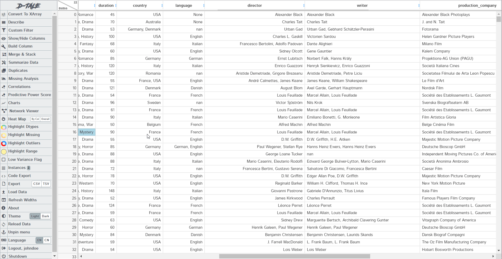

Among data exploration features you can detect outliers, find patterns and correlations, detect missinng values, 
generate comprehensive column reports    

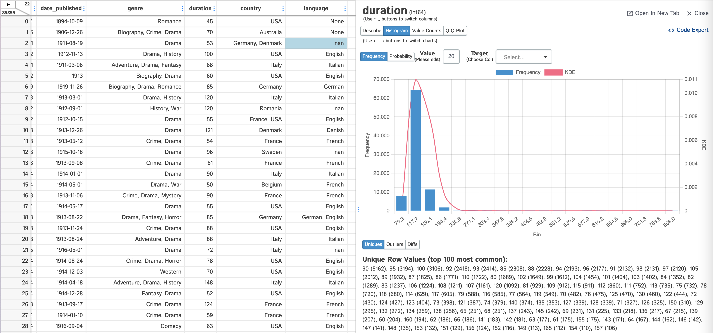

With D-Tale you can perform certain data transformation steps, such as change types, clean data, 
remove duplicates, creation of new columns

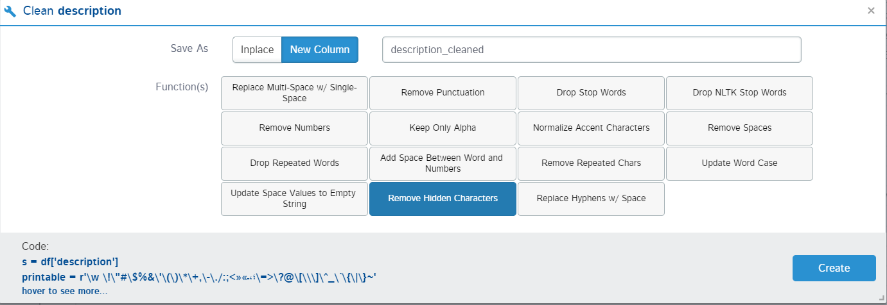

Select "Dataframe Functions" from the main D-Tale menu, in order to create new column 

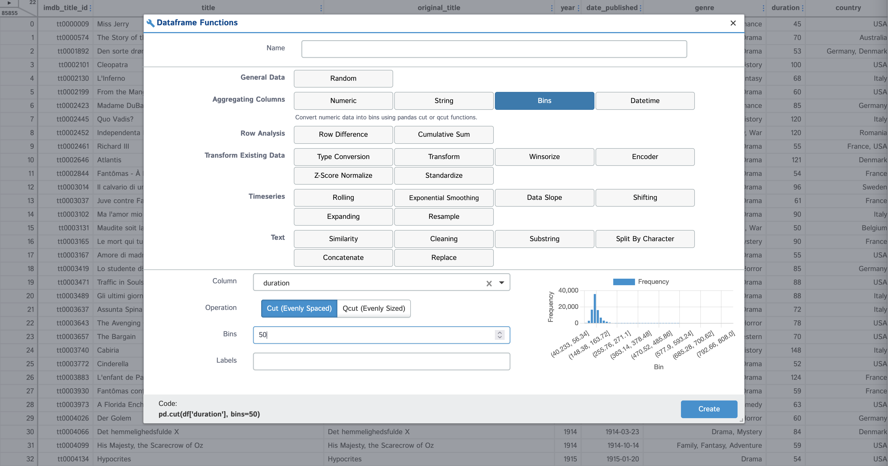


## D-Tale Charts 

D-Tale Charts is somewhat hidden among other D-Tale options, but it is an awesome feature for analytical exploration and 
visualisation of the dataset or pandas dataframe. You can build complex charts interactively. This can be used for reporting or 
visual patterns and trends discovery

To open D-Tale Charts, select "Charts" from the main D-Tale menu
 
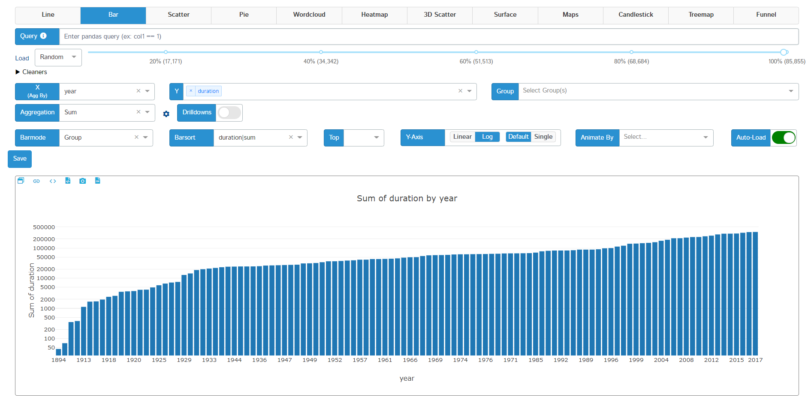


## Pandas data frames in D-Tale  

D-Tale can visualize pandas dataframes too. Open tutorial notebook `tutorials/d-tale.ipynb`, follow the instructions and 
execute cells.  

After you execute cell which containe the line 

```
dtale.show(df, host="0.0.0.0", port=8038, force=True)  # host and port are important!
```

open Quickstart page, go to "My Apps" and open app on port 8038. You will see the D-Tale, loaded with your pandas dataframe 


