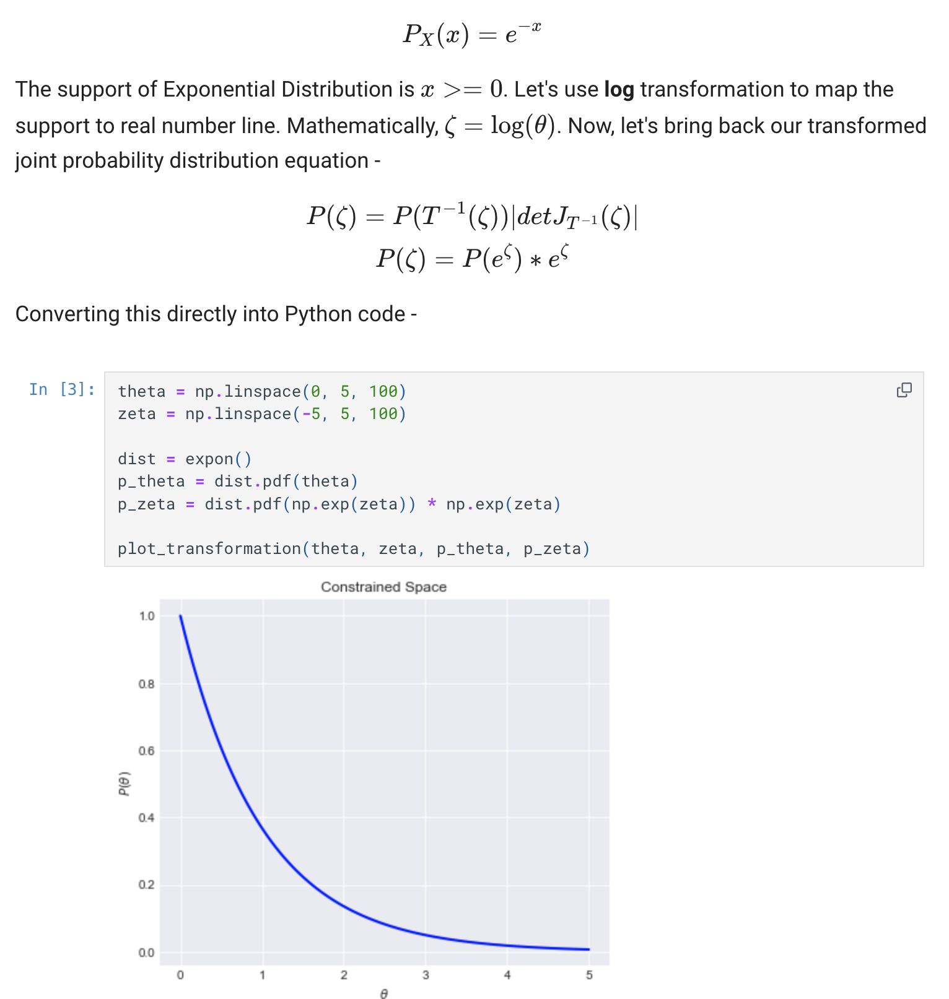
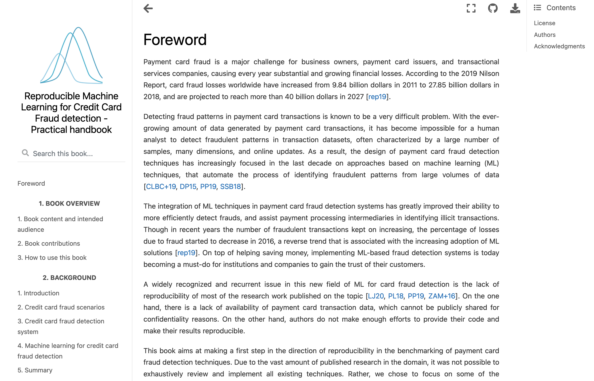

## Documentation an materials

With the help of the Workspace you can create awesome static documentation websites and pdf documents from 
Markdown and Jupyter notebooks. Below is an example of MkDocs scientific document created from the notebooks 



### Mkdocs

With MkDocs you can use Jupyter Notebooks in MkDocs. This means you can create MkDocs pages not only from 
Markdown files, but also from Jupyter notes, where you can mix Markdown, code, outputs and visualisations such 
as maps, charts and plots.   

Workspace contains an example MkDocs project to demonstrate this functionality. 

Although, it is not necessary, separate conda environment will be used to isolate MkDocs project dependencies.   

To start, cd to the example project folder

```
cd /home/examples/mkdocs
```

Install dependencies

```
conda install pip 
python -m pip install -r requirements.txt
```

Start mkdocs dev server 

```
conda activate mkdocs
python -m mkdocs serve -a 0.0.0.0:8040
```

MkDocs dev server is being served on port 8040, and we have shortcut on the Quickstart page to open it.  


There are 3 pages, one demonnstrates the extended Markdown features, two other - are Jupyter notebooks as MkDocs pages. 
This running app - is a development server with live updates, all changes to the notebooks or .md files will be applied 
without the need to restart.  


__NOTE:__ You don't need to execute notebook when rendering with MkDocs. Notebook that was run on any other environment, if 
it contains all required output, can be included to MkDocs.  

This example bolierplate MkDocs project lots lots of other extra-Markdown features. When dependencies are installed, 
it has the features of the MkDocs MagicSpace. Check out [**documentation and tutorials](https://mkdocs-magicspace.alnoda.org/) 

### Jupyter book 

You can also create awesome static websites with [Jupyter Book](https://jupyterbook.org/en/stable/intro.html) - an open source project for building beautiful, 
publication-quality books and documents from computational material.   

Here is a basic hands-on example of how to get started with the Jupyter Book.  

Clone the repository containing the demo book source files

```
cd /home/project
git clone https://github.com/Fraud-Detection-Handbook/fraud-detection-handbook
cd fraud-detection-handbook
```

Install dependencies

```
pip install -r requirements.txt
```

Build the Jupyter Book 

```
cd ..
jupyter-book build fraud-detection-handbook
```

Move the resulting static website into the folder that you can view with Static Server, 
and delete the root index.html that prevents Static Server to render site properly

```
mv fraud-detection-handbook/_build/html /home/static-server
```

From the Quickstart page open Static Server, and go to `html/docs` folder 




**NOTE:** this is Jupyterbook - computational reproducible resource. You can reproduce all the computations using 
the notebooks in the cloned folder.