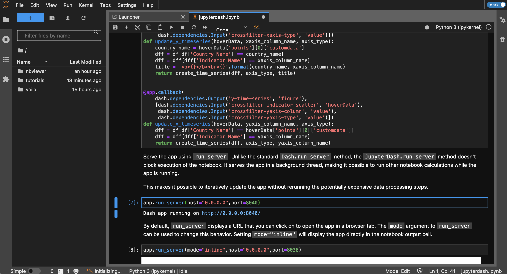
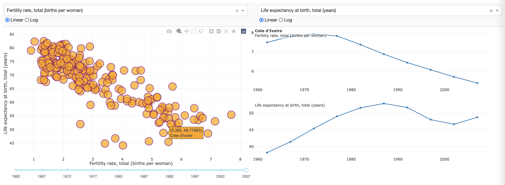
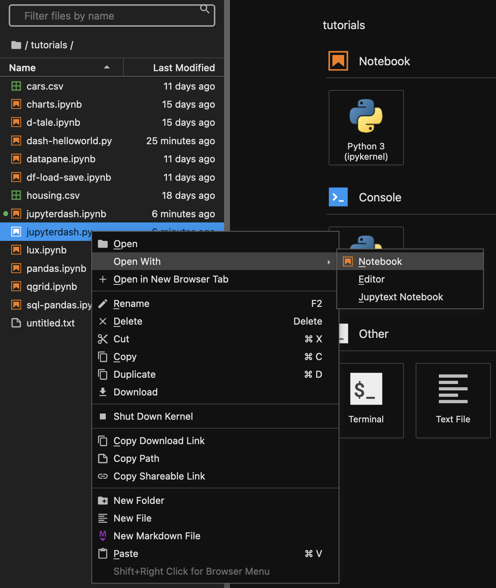
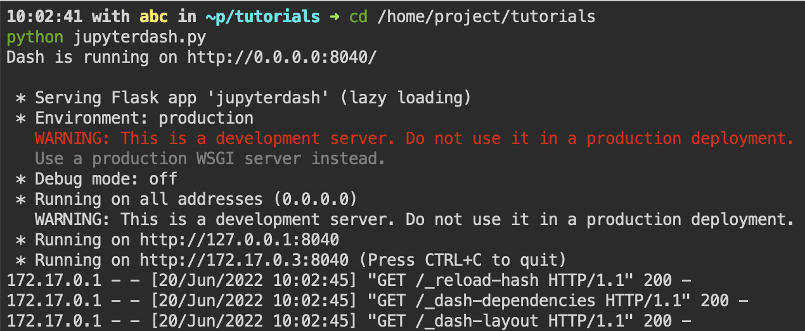

# Interactive web applications

Jypyter notebooks can be converted to interactive web applications, where users can interactively chose parameters 
that would become inputs to the notebooks, forcing notebooks to re-run entirely or partially. 


## Mercury 

[Mercury](https://mercury-docs.readthedocs.io/en/latest/) is a perfect tool to convert Python notebook to interactive web app, 
slides, dashboard, report, REST API and share with non-programmers.  

Compared to Voila (which runs notebook only once at start) Mercury allows multiple parameterized executions. Notebook 
has a set of parameters which can be varied by the end user, triggering re-running of the notebook.  

It is very easy to turn any notebook into an interactive web application. It does not require serious changes to the notebook 
to become mercury app. You would only need to add a raw cell with the params yaml that would define input widgets for your variables. 
Definition of the widget (in params) starts with the widget name. It should correspond to the variable in the code (in the notebook).  

Check [Mercury documentation](https://mercury-docs.readthedocs.io/en/latest/) for more details. 

Mercury is not started by default. If you want to use it, start it from the terminal.  

Serve example folder with Mercury

```
cd /home/examples/mercury; mercury run 0.0.0.0:8035
```

Open Quickstart page, go to "Results" tab and open Mercury.   

You can explore different[Mercury examples](https://mercury.mljar.com/). To try them on your own, downnload examples to the workspace  

```
cd /home/project
git clone https://github.com/pplonski/mercury-demo-notebooks
```

Serve these examples with Mercury 

```
cd mercury-demo-notebooks
mercury run 0.0.0.0:8035
```

Open any of the example notebooks in the JupytterLab to see how Mercury yaml definitions turn them into the interactive web applications.  

#### Running Mercury permanently 

If you want to run Mercury permanently, add `&!` to the end of the `mercury run` command.  

For example, to serve cloned example mercury folder, execute 

```
cd mercury-demo-notebooks; mercury run 0.0.0.0:8035 &!
```


## Jupyter-Dash

[Dash](https://dash.plotly.com/introduction) is the original low-code framework for rapidly building data apps in Python. 
Workspace has Dash installed. You can try running Dash hello-world example from the `/home/project/tutorials` folder.  

```
cd /home/project/tutorials 
python dash-helloworld.py
```

If you look in the .py file, you would see that Dash application runs on host "0.0.0.0" (!important) and port 8038. Now you can 
go to the workspace Quickstart page, navigate to "My apps" tab, and open Application on port 8038  


[Jupyter-Dash](https://github.com/plotly/jupyter-dash) library makes it easy to develop Plotly Dash apps interactively 
from within Jupyter environments.  

Workspace includes notebook with an example Dash application that you can start directly from the notebook. Open JypyterLab, 
go to the folder 'tutorials' and open notebook 'jupyterdash.ipynb' Execute cells to run the dash application. 

You need to run a cell `app.run_server(host="0.0.0.0",port=8040)` to start Dash application

 

Now you only need to open the Application on port 8040 from the Quickstart page ("My apps" tab).  

 

Even better is to create a .py notebook with Jupytext. Then you can develop Dash applications with JupyterLab, and run them 
as a python applications at the same time! Workspace includes such an example - file "jupyterdash.py" in the "tutorials" folder. 
You can open this python script with JupyterLab, and develop it like a notebook.  

 

And at any moment you can also run it in the terminal 

```
cd /home/project/tutorials 
python jupyterdash.py
```

 

