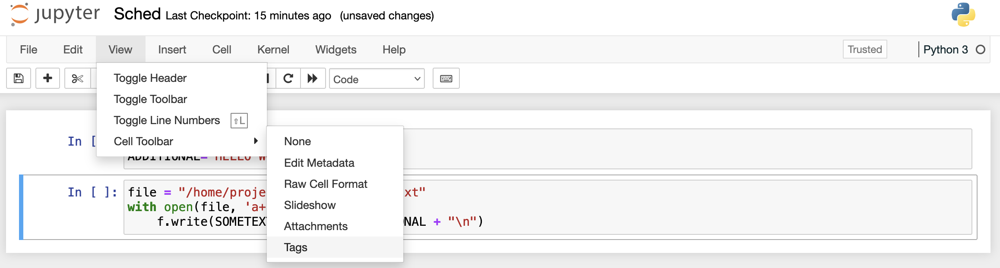
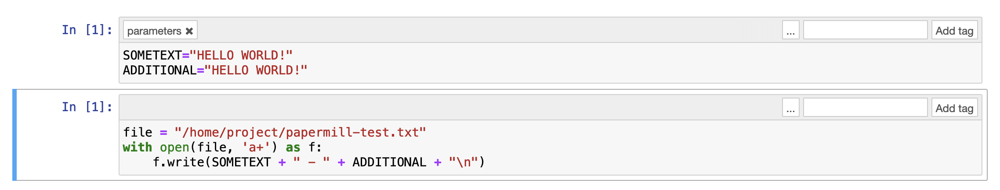
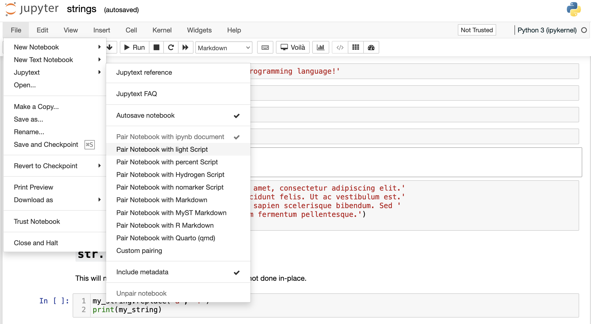
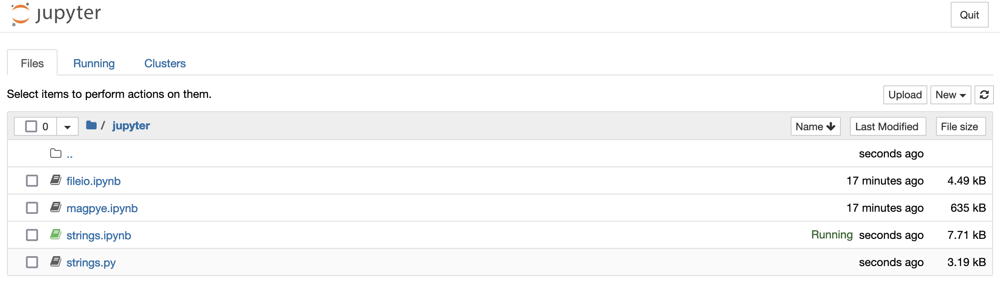
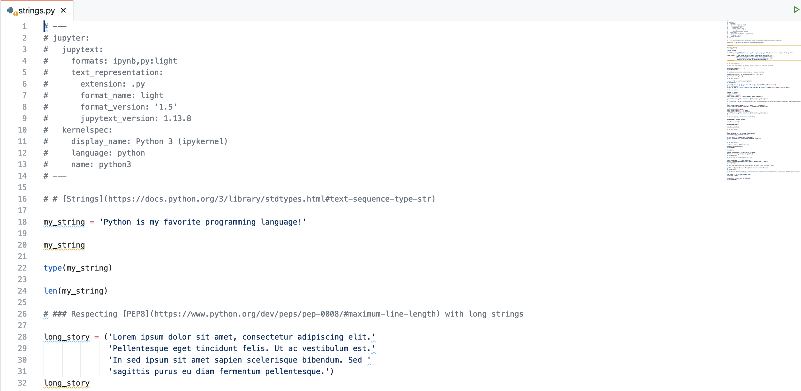
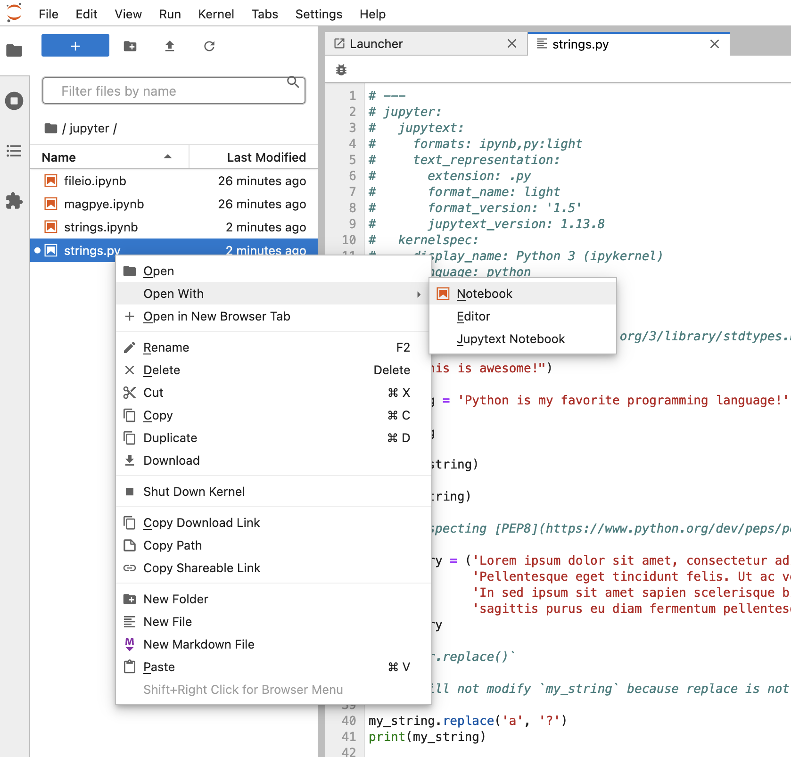
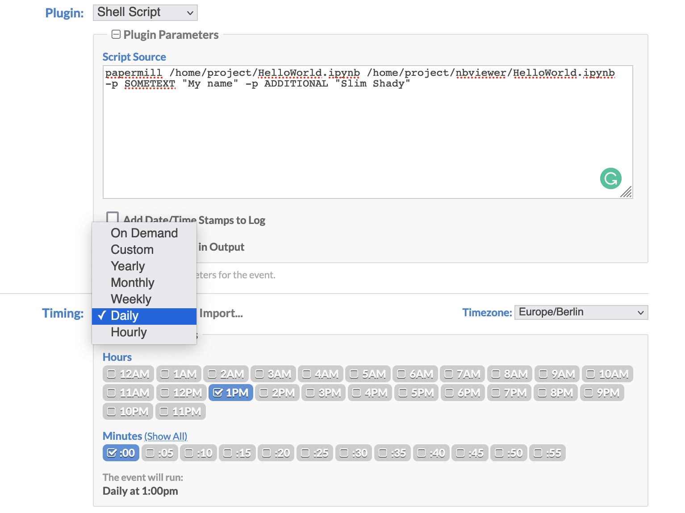

# Productionizing notebooks 

Notebooks are usually used for exploration, analysis, experiments and visualisations.  

Notebook that were created as a result of exploration, experimentation and as POC can be "productionalized". 
"Productionalizing" notebooks means tutning them into executable notebooks which can be executed automatically 
without manual triggering, run on schedule and produce arftifacts, such as reports, data, machine learning models, etc.  

There are several alternative ways to productionalize notebooks:

1. manual conversion: create executable python scripts by copying code from notebooks into python files by hand
2. parameterize and execute notebooks without conversion
3. programmatic conversion of notebooks to python scripts, and schedule executions

In addition you might want to schedule automatic executions of notebooks or converted notebooks.    


## Manual conversion

This is the most widely used approach. The code is copied from the notebooks into the new script or application, providing 
great flexibility. The structure of the resulting application might differ significantly from the notebook, which allows 
better structuring of the code, applying abstractions, such as classes (which are raraly used in the notebooks), creation of 
unit and integration tests, etc.  

This approach suits better when the resulting application is complex, consists of many classes, files and modules. But when 
the resulting application or script does not differ much from the initial notebook, this approach creates extra overhead, requires 
more timeand slows down the iteration of experimentation-development-productionalization cycles.  

## Notebooks without conversion

In many situations it is enough to simply execute the notebook. It might be enough if the notebook is straightforward and 
result is generated dataset or report, transformation of data in the database, retrained machine learning model.  

The typical use-case is for example, scheduling of data extraction from the database and providing the result as csv 
file for end-users, scheduling of SQL stored procedures in the database, web-scrapping tasks, fetching Google Analytics statistics, 
fetching cryptocurrency daily prices, etc.  

Execution of notebooks without any transformation removes extra overhead, allows move faster from the experiment to the 
end result. 


## Auto conversion

## NBClient

[NBClient](https://github.com/jupyter/nbclient) is a tool for running Jupyter Notebooks in different execution contexts, 
including the command line. NBClient makes it possible to run command  `jupyter execute` which runs Notebook cells one-by-one.  
  
For example, to execute notebook 'basic-notebook.ipynb' in folder /home/examples/notebooks' you would execute command

```
jupyter execute /home/examples/notebooks/basic-notebook.ipynb
```

This will execute each note in the notebook. 

NBClient might handy, if you need to automate such tasks as web scrapping, data analysis or preparation, 
retraining of machine learning models.


## Nbterm

[Nbterm](https://github.com/davidbrochart/nbterm) lets you view, edit and execute Jupyter Notebooks 
in the terminal, and produce the new notebook as a result of execution.  

One of the differences between NBClient and Nbterm, is that the latter produces new notebook as a result. This 
is especially useful if you plan to use notebooks as reports.  

An example use-case would be querying datasase, computing statistics from new orders or client activity, 
and providing read-only executed notebook via NBviewer. Such notebook will contain both code, SQL as well as 
results of execution - statistics, chartss and plots.  

For example, to execute notebook 'basic-notebook.ipynb' in folder /home/examples/notebooks' you would execute command

```
cd /home/examples/notebooks; nbterm --run basic-notebook.ipynb --save-path /home/project/voila/basic-notebook.ipynb
```

Because flag `--save-path` was defined, executed notebook has been saved to 'basic-notebook_run.ipynb' 
in folder '/home/project/voila/'. Workspace serves notebooks in this folder with Voila.  

From the Quickstart page open Voila, and view the notebook in browser. 


## Papermill

[Papermill](https://papermill.readthedocs.io/en/latest/index.html) is a tool for parameterizing, executing, 
and analyzing Jupyter Notebooks.  

Papermill solves the problem of parameterizing notebooks in a simple and efficient way. Jupyter notebooks allow users to tag cells. 
Papermill lets you to tag a cell, which contains parameters with parameters tag.   

To parameterize a notebook, designate a cell with the tag parameters.  

As an example, open Jupyter notebook from the Quickstart page, and create a new note.  

First thing to do - is to enable tags. Click `View -> Cell Toolbar -> Tags`. This will enable the tags UI.



Create first cell and add tag 'parameters' - simply a variable with default value

```
SOMETEXT="HELLO WORLD!"
ADDITIONAL="HELLO WORLD!"
```

Create another cell where variables are used

```
file = "/home/project/papermill-test.txt"
with open(file, 'a+') as f:
    f.write(SOMETEXT + " - " + ADDITIONAL + "\n")
print(SOMETEXT + " - " + ADDITIONAL + "\n")
```



Give your notebook a name, for example 'HelloWorld' and save. Open terminal and execute with different parameters

```
papermill /home/project/HelloWorld.ipynb /home/project/nbviewer/HelloWorld.ipynb -p SOMETEXT "My name" -p ADDITIONAL "Slim Shady"
```

The result notebook will be produced to the folder served by Nbviewer. From the Quickstart page open Nbviewer, 
and view the notebook in browser.

This notebook also creates a file `/home/project/papermill-test.txt`.  

Read in [this article](https://segmentfault.com/a/1190000040036521/en) which explains how to use Jupyter Notebooks 
(using Jupytext and Papermill) to automatically generate reports.  

You can schedule generation of automatic reports, which will output to folder served by Nbviewer or Voila.   


## Programmatic conversion

### Nbconvert

[Nbconvert](https://nbconvert.readthedocs.io/en/latest/index.html) tool allows you to convert an .ipynb notebook 
file into various static formats including executable scripts.  

For example, if you want to convert Jupyter notebook `/home/examples/jupyter/strings.ipynb` to a Python script, 
you would execute 

```
jupyter nbconvert --to script /home/examples/jupyter/strings.ipynb --output /home/project/strings
```

Now you can execute this newly-generated python script 

```
python /home/project/strings.py
```

Nbconvert can convert to other formats too, such as HTML, PDF, LaTeX. Check tutorial about reports.


### nbless

The [nbless](https://github.com/py4ds/nbless) Python package includes `nbconv` shell command, which makes conversion 
of python notebooks into various commands, including .py executable scripts.  

To try it with the example notebook, execute in terminal

```
nbconv /home/examples/jupyter/strings.ipynb --exporter python --out_file /home/project/nbless-strings.py
```

You will see that file 'nbless-strings.py' has appeared in the '/home/project' folder, Execute it 

```
python /home/project/nbless-strings.py
```


### Jupytext

[Jupytext](https://jupytext.readthedocs.io/en/latest/) can save Jupyter notebooks as python or markdown.  

Try converting example notebooks to python script

```
jupytext --to py /home/examples/jupyter/strings.ipynb  --output /home/project/jupytext-strings.py
```

In addition, Jupytext has a plugin for Jupyter that can save Jupyter notebooks as either
Markdown files or scripts. Scripts created with Jupytext can be edited and modified just like standard notebooks.  

Moreover, Jupytext allows to create notebooks paired with the scripts, with any changes made to the notebook automatically 
applied to the scripts.  

To get a feeling how this works, copy example notebooks to the project folder 

```
cp -r /home/examples/jupyter /home/project
```

From the Quickstart page open Jupyter notebook, and then open note 'strings.ipynb' in the copyed folder. 
In Jupyter Notebook, pair your notebook to the script format with the Jupytext menu



If you refresh the tree folder, you will see that file `strings.py` appeared 



You can open this file in VS-Code and see that this is indeed a python file with some meta information on the top, as a comment.  



You can execute this file from the terminal

```
python /home/project/jupyter/strings.py
```

Awesome! Now if you change the original notebook, you will find out that this script is automatically changed too. 

Moreover, you can open this `strings.py` file in Jupyter as a notebook! You can modify and execute cells. As soon as you save 
changes, refresh the original .ipnb notebook, and it will be automatically get your latest updates.  

You can also work with this script as notebook in the Jupyter Lab! You just need to explicitly open this file as notebook.  




## Scheduling automatic executions

You can schedule automatic executions of your notebooks or converted notebooks. 

If workspace is in cloud, it becomes a simple reporting solution. The resulted executions can generate data, reports 
or other artifacts that can be downloaded with Filebrowser or viewed with Voila or NBviewer.  

If you run workspace on your local machine, make sure you enable "Catch Up" for scheduled events. This will automatically 
run all missed events after you turn on your laptop. Hence, you can have generated reports every day without the need 
to manually trigger every notebook. 


## Cronicle

With [Cronicle](https://github.com/jhuckaby/Cronicle) we can easily schedule executions of shell commands and scripts. Cronicle 
has WEB UI, monitor of executions, collect logs and advanced features such as limiting resources for each execution.  

From the Quickstart page open Cronicle, (Cronicle user/pass: admin/admin), go to 'Schedule' and add new Event. Chose category 'General' 
and plugin 'Shell script'. Now we can configure the schedule, and provide any of the command to be executed.  

To execute notebook, parameterized with Papermil daily, simply paste the command to the 'Script Source' box, and 
configure time when you want Jupyter notebook to run 




