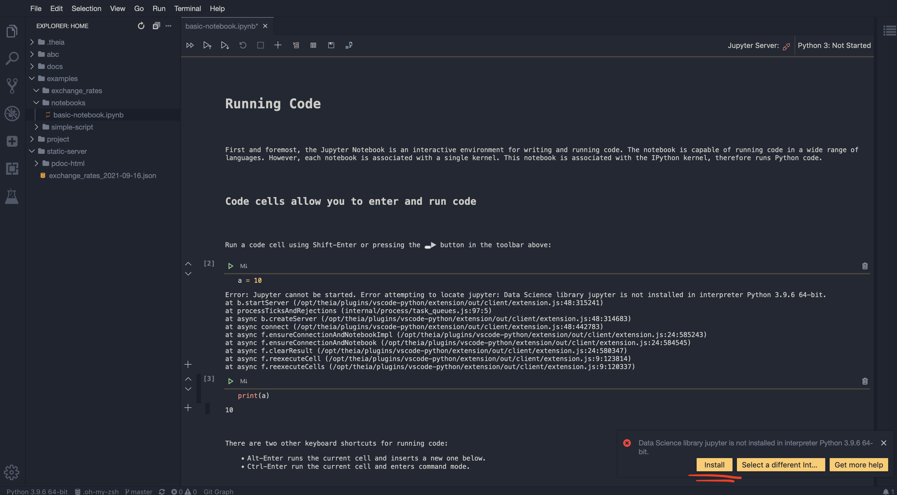
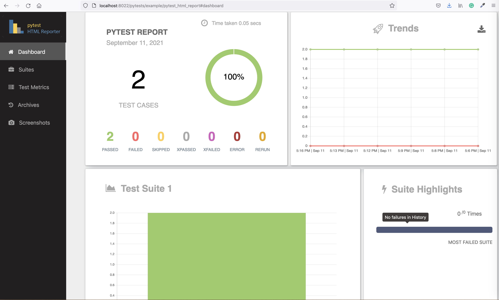
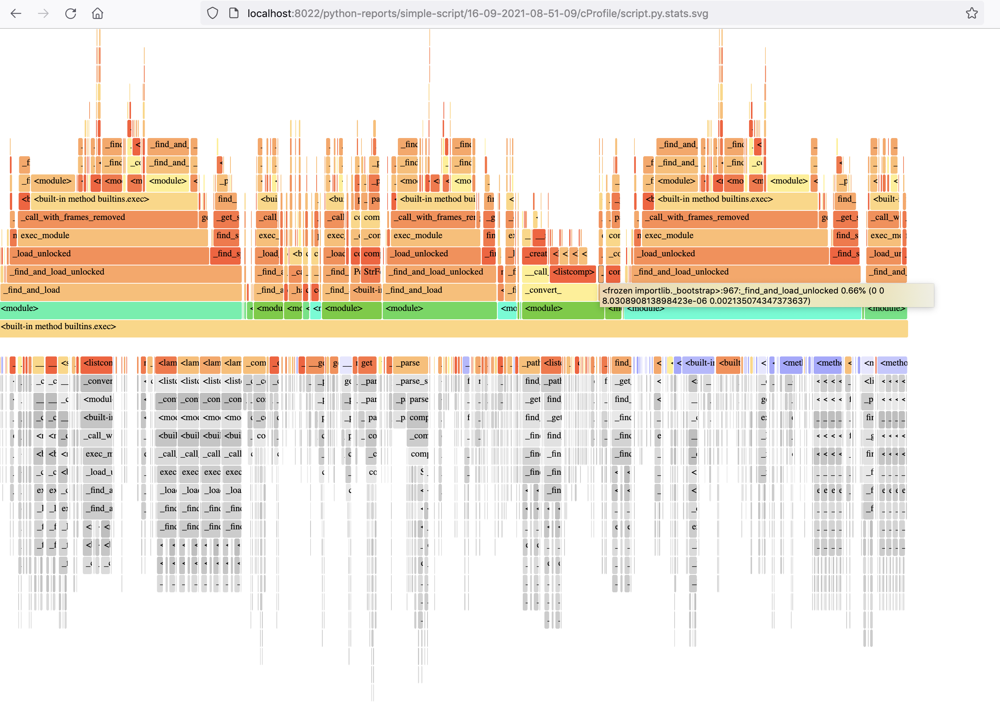

This doc contains example tutorials how to use Python tooling included in Python workspace.   

To start, open Quickstart page for quick access to VS-code and terminal.

## IPython and Notebooks

[IPython]((https://ipython.readthedocs.io/en/stable/)) provides a rich toolkit to help you make the most of using Python interactively. One of its main components 
is a powerful interactive Python shell. IPython is very handy. For example, starting with IPython 7.0, and when using 
Python 3.6 and above, IPython offer the ability to run asynchronous code from the REPL.  

To start IPython kernel, open workspace terminal ad execute `ipython`. Below is an example of installing packages and 
evaluation of async code in IPython shell - something you cannot do in a standard python shell: 


**NOTE:** in order not to increase the Workspace size, by default Python Workspace can only render notebooks. 
Workspace does not have installed all the requirements to run notebooks. This is can be done easily. As soon as you 
try to run a cell in the note, you will see a pop-out winndow suggesting to install missing dependencies. You just need to accept. 

<div align="center" style="font-style: italic;">
    Demo: Install dependencies for notebooks
</div>



## Python versions

### Pyenv

[pyenv](https://github.com/pyenv/pyenv) is used to isolate Python versions. For example, you may want to test your code against 
Python 2.7, 3.6, 3.7 and 3.8, so you'll need a way to switch between them. 

List python versions

```
pyenv install --list
```

Install additional python versions

```
pyenv install 3.10.4
pyenv install  3.6.0
pyenv install 3.10.7
```

Check installed python versions

```
pyenv versions
```

Change global python version 

```
pyenv global 3.10.4
```

Check python version

```
python --version
```

Create folder with local python environment, check Python version

```
mkdir test-pyenv
cd test-pyenv
pyenv local 3.6.0
python --version
```

If you want to schedule script (with Cronicle) that uses pyenv, add `eval "$(pyenv init -)"` before the script. 
For example `eval "$(pyenv init -)"; python /home/project/scripts/script.py`

## Python environments 

### Venv

The [venv](https://docs.python.org/3/library/venv.html#module-venv) virtualenv is a very popular tool that creates isolated Python environments for Python libraries. 
This module provides support for creating lightweight 
“virtual environments” with their own site directories, optionally isolated from system site directories. 
Each virtual environment has its own Python binary (which matches the version of the binary that was used to create this environment) 
and can have its own independent set of installed Python packages in its site directories.

Create virtual environment called env-1

```
python3 -m venv env-1
```

Activate environnment

```
source env-1/bin/activate
```

### Poetry

Create our project

```
poetry new poetry-demo
cd poetry-demo
```

Specify dependencies in pyproject.toml.   

By default, poetry creates a virtual environmen. There are several ways to run commands within this virtual environment. 
To run your script simply use poetry run

```
poetry run python your_script.py
```

The easiest way to activate the virtual environment is to create a new shell with poetry shell 

```
poetry shell 
```


## Python tooling  

### Python-report 

Python-report is a small utility that tryies to generate various reports and artefacts from your python project, such as linting 
report; run tests and make HTML report; make auto-documentation and profiling visualizations. Unit test statistics will be visualised 
with the browser-based dashboard.  

> `cd /home/examples/simple-script && python-report `

The resulting report will be produced to the folder `/home/static-server/<NAME-OF-PYTHON-PROJECT-FOLDER>/<TIMESTAMP>`.  

<div align="center" style="font-style: italic;">
    Demo: Python report
</div>


*(In addition, all pytests statistics will be collected, and available in foldder `/home/static-server/<NAME-OF-PYTHON-PROJECT-FOLDER>`)*.  

Python-report is a simple bash script `/home/abc/utils/python-report.sh`. You can also use separately any of the toos.  

### [Pytest-html-reporter](https://github.com/prashanth-sams/pytest-html-reporter) 

Pytest-html-reporter generates a beautiful static html report based on pytest framework. These reports result in dashboard website, 
that shows all historical tests and statistics.   



To execute tests, and generate report with Pytest-html-reporter, cd to the python project tests folder, 
and execute `pytest ./ --html-report=./pytest-report`. The results will be produced to the sub-folder `./pytest-report`.  

For instance, execute tests and generate report for the example python project execute 

```
cd /home/examples/simple-script && pytest ./ --html-report=/home/static-server/my-pytest-report 
```   

the output will be in folder `/home/static-server/my-pytest-report` that is served with a Static-file server

<div align="center" style="font-style: italic;">
    Demo: Pytest-html-reporter
</div>


### [Pdoc3](https://github.com/pdoc3/pdoc)

Auto-generate API documentation for Python projects. Let's generate autodocumentation website for the example python project, 
with output into `` where it can be viewed with Static-file server  

``` 
cd /home/examples/simple-script && pdoc --html --output-dir /home/static-server/pdoc-html ./  
```

<div align="center" style="font-style: italic;">
    Demo: Pdoc3
</div>


### [Vprof](https://github.com/nvdv/vprof)

Vprof is a Python package providing rich and interactive visualizations for various Python program characteristics 
such as running time and memory usage. 

Vprof is a browser-based profiling tool. Here is an example of profiling scripts from the example python project: 

```
cd /home/examples/simple-script && vprof -H 0.0.0.0 -p 8031 -c cpmh fib.py    
cd /home/examples/simple-script && vprof -H 0.0.0.0 -p 8031 -c cpmh script.py 
```    

<div align="center" style="font-style: italic;">
    Demo: Vprof
</div>


### [SnakeViz](https://jiffyclub.github.io/snakeviz/)

SnakeViz is a browser based graphical viewer for the output of Python’s cProfile module. Let's profile 
and visualize one of python modules in the example project: 

```
cd /home/examples/simple-script && python -m cProfile -o script.prof script.py    
snakeviz -s -p 8030 -H 0.0.0.0 script.prof 
```   

You will see thae link appeared in the terminal, open it in browser 

<div align="center" style="font-style: italic;">
    Demo: SnakeViz
</div>


### [Flameprof](https://github.com/baverman/flameprof/)

Flameprof is a Flamegraph generator for python's cProfile stats. 

Let's profile and visualize one of python modules in the example project:

```
cd /home/examples/simple-script && python -m cProfile -o script.prof script.py   
flameprof script.prof > script.svg 
```   

<div align="center" style="font-style: italic;">
    Demo: Flameprof
</div>




### [Pyinstrument](https://pypi.org/project/pyinstrument/3.0.0b3/)

Pyinstrument is a Python profiler. A profiler is a tool to help you 'optimize' your code - make it faster. 
It sounds obvious, but to get the biggest speed increase you must focus on the slowest part of your program. 
Pyinstrument helps you find it!   

Profile and visualize one of python modules in the example project:

```
mkdir -p /home/static-server/profiling/basic-python-script    
pyinstrument -t -r html -o /home/static-server/profiling/basic-python-script/p2  script.py 
```

<div align="center" style="font-style: italic;">
    Demo: Pyinstrument
</div>
 


### [cProfile](https://docs.python.org/3/library/profile.html#module-cProfile)

cProfile is recommended for most users; it's a C extension with reasonable overhead that makes it suitable 
for profiling long-running programs. Profile and visualize one of python modules in the example project:

```
cd /home/examples/simple-script && python -m cProfile script.py >> /home/static-server/cprof.tx 
```


### [Pylint-json2html](https://github.com/Exirel/pylint-json2html)

A pylint JSON report file to HTML: pylint is used to generate a JSON report, and this tool will transform this report into 
an HTML document: 

```
pylint script.py | pylint-json2html -f jsonextended -o script.html 
```   

<div align="center" style="font-style: italic;">
    Demo: Pylint-json2html demo
</div>


### Pre-commit 

Git hook scripts are useful for identifying simple issues before submission to code review. We run our hooks on every commit 
to automatically point out issues in code such as missing semicolons, trailing whitespace, and debug statements. By pointing 
these issues out before code review, this allows a code reviewer to focus on the architecture of a change while not wasting 
time with trivial style nitpicks.

The example python project has a pre-commit configuration file:
 
```
cd /home/examples/simple-script && pre-commit install  
pre-commit run --all-files 
```
 
### Schedule python jobs

Workspace inncludes [Cronicle](https://github.com/jhuckaby/Cronicle) - a powerful scheduling tool, that has a browser-based UI with dashboards, 
allows to configure resource limits for jobs and much more!  

Python Workspace includes an example script that fetches today's exchange rates:   

```
cd /home/examples/exchange_rates   
python fetch-rates.py 
```

The script will fetch today's exchange rates from and output result to the folder `/home/static-server/exchange-rates_<DATE>.json`. This 
folder is served by the Static-file server 

<div align="center" style="font-style: italic;">
    Demo: Fetch exchange rates
</div>

 

Fetching echange rates - is a typical problems for nearly every business, that is working on the international market. You can 
schedule execution of this script to fetch exchange rates daily  

<div align="center" style="font-style: italic;">
    Demo: Schedule exchange rates
</div>

 

**NOTE:** Scheduling jobs is especially useful when the Workspace is running on a cloud server. 
[Read here how to launch workspace in cloud](#secure-remote-workspace).